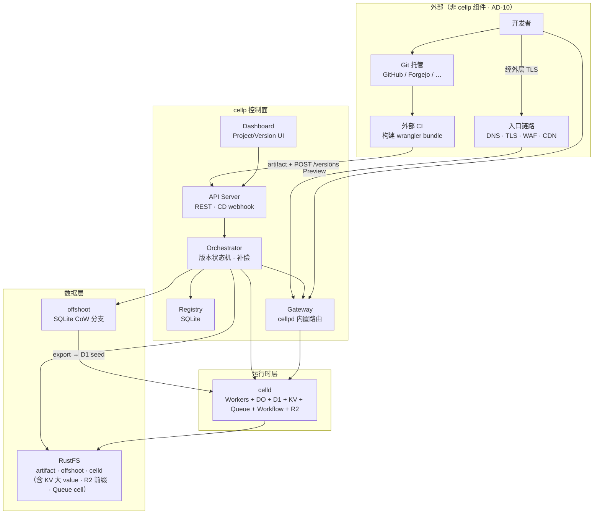
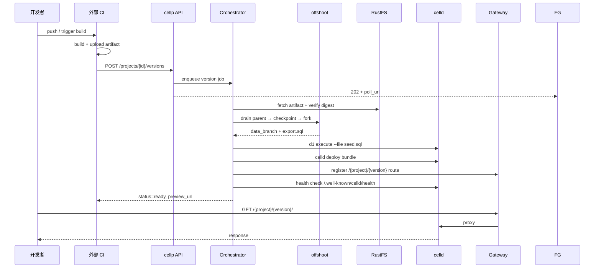
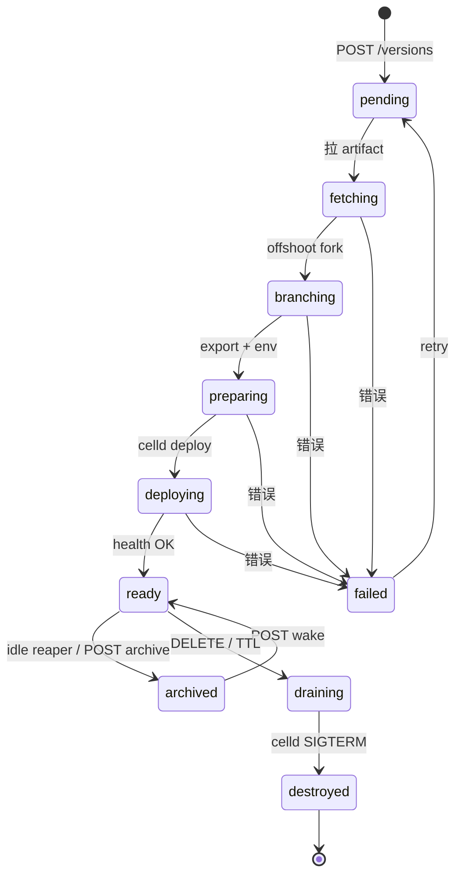
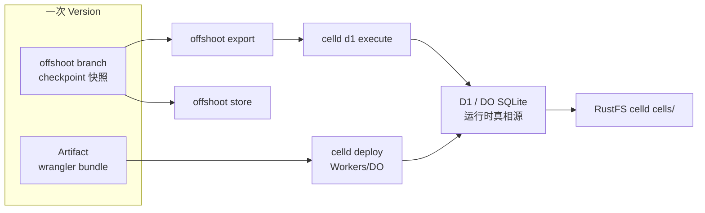
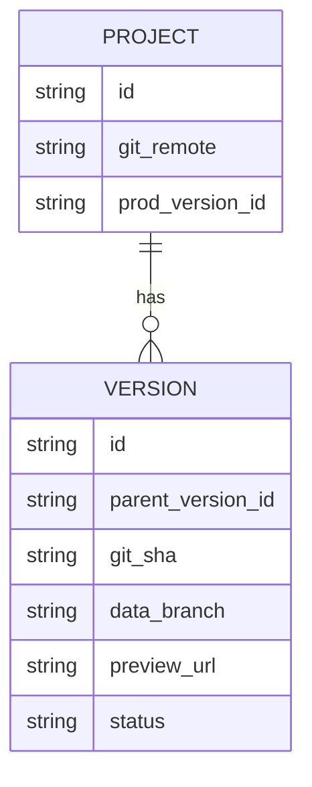

# cellp 设计文档

> **给开发者用的产品文档（非本文）：** [https://konghayao.github.io/cellp/](https://konghayao.github.io/cellp/)  
> **cellp** — 版本化的 Serverless 应用运行时（cell + platform）  
> **唯一设计入口（实现 / Agent）** · 管理维度：**Project + Version**（**无用户体系 · AD-10**）  
> 决策摘要：[docs/decisions.md](./docs/decisions.md)（**AD-10** 产品边界） · 本地 Dev：`dev/scripts/up.sh` · Agent：`AGENTS.md` · `dev/AGENTS.md`

---

## 1. 概述

**cellp** 是 **私有化 Workers 平台控制面**：在外部 CI 每次投递时，同时 version 化 **App + Data**，经 Gateway 提供 preview / prod 可访问环境。

**不是：** 自托管 Cloudflare、自托管 Vercel、Git 平台、账号中心、全球边缘 CDN。  
**是：** Version 生命周期 · offshoot + D1/KV/R2/Queue branch · promote 切流 · Bindings 运维 API · Dashboard。

**部署约束：100% 私有化。** 不依赖 AWS / Cloudflare / Azure 等任何外部托管云服务；全部组件运行在自有硬件、私有 VPC 或自建 K8s 上。

### 1.1 核心范畴（cellp 做什么）

| # | 能力 | 说明 |
|---|------|------|
| 1 | **Version CD** | 外部 CI → artifact → `POST /versions` → poll → `ready` |
| 2 | **App + Data 同版** | offshoot fork/export；根 version D1 import；子 version D1 branch |
| 3 | **Binding branch** | 子 version：D1 · KV · R2 · Queue（AD-8）；Workflow / Cron / Worker 脚本不 branch |
| 4 | **运行时隔离** | 每 ready version 独立 celld 进程 + 独立 bucket（AD-1） |
| 5 | **Gateway** | `/{project}/{version}/` 预览；`/{project}/` 生产（AD-2） |
| 6 | **Promote** | saga 切流：drain · offshoot promote · CAS prod（AD-5） |
| 7 | **Bindings 运维** | `GET …/bindings`；KV / Queue / D1 operator；Workflow 只读 |
| 8 | **Worker env** | per-version 覆盖 → `CELLD_VARS_FILE`；Dashboard / API 可编辑 |
| 9 | **Registry** | SQLite：project · version · route · prod 指针 · jobs |
| 10 | **Dashboard** | 运维 UI；**仅**消费 cellpd `:8790` REST API |

完整否定清单与边界论证见 **[docs/decisions.md §15 AD-10](./docs/decisions.md#15-ad-10--产品边界权威否定与核心范畴)**。

### 1.2 权威不做（AD-10）

| 类别 | 决策 | 由谁承担 |
|------|------|----------|
| **账号 / 租户** | **坚决不做**用户、Org、RBAC、SSO | 外层生态，或共享 `DEPLOY_TOKEN` / `ADMIN_TOKEN` |
| **Git / CI** | **不做**仓库托管、Webhook、PR 集成 | GitHub / Forgejo / GitLab + 外部 CI → `POST /versions` |
| **链路层** | **不做** DNS · CDN · TLS 终止 · WAF · DDoS | 外层 Nginx / LB / 自有网关等项目 |
| **全球边缘** | **不做** Cloudflare 式 PoP；**分布式**即可 | 多 cellpd + RustFS + celld fleet（二期扩展） |
| **PaaS 托管** | **不做** Next.js SSR · Node serverless · Pages | wrangler → celld Workers 形态 only |

**一期诚实范围：** 单节点（或 VIP 单入口）preview/prod 平面。ready version **无数量硬上限**；不活跃 preview 以 **archived** 停进程（AD-9）。

**Bindings 诚实范围：** 沿用 celld 已有 CLI 与 wrangler key。D1 · KV · R2 · Queue 子 version **branch**（AD-8）；Workflow / Cron / Worker 脚本**不** branch。

### 能力分期

| 阶段 | 范围 | 能力 |
|------|------|------|
| **一期** | 核心 Serverless 平台 | **CD 全流程**（外部 CI → artifact → `POST /versions` → preview URL）· **Branch + Version**（App+Data）· **线上稳定**（promote · quiesce · saga · health gate） |
| **Bindings（本期）** | celld 0.4.0 绑定治理 | **KV / Queues / Workflows / Cron** 沿用 celld；R2 **清单可见**；D1/KV/R2/Queue **branch**（AD-8） |
| **二期** | 弹性 | scale-to-zero 唤醒 · **多节点 cellpd**（分布式，非全球边缘）· Gateway 路由缓存（未实现） |
| **三期** | 可观测 · 性能/统计 | **OTEL / 日志 / 指标** · 用量与性能统计 · （**暂不计划实施**，仅文档占位） |

| 阶段 | 能力 | 底层 |
|------|------|------|
| **一期** | 部署 App + CD | celld + cellpd |
| **一期** | Branch + Version | offshoot |
| **一期** | Promote / 线上 cutover | cellpd Orchestrator |
| **一期** | D1 import / branch | celld `d1 import` · `d1 branch` |
| **Bindings** | KV / R2 / Queue branch | celld `kv branch` · `r2 branch` · `queue branch`（AD-8） |
| **Bindings** | Workers KV | celld `kv_namespaces` + `celld kv` |
| **Bindings** | Queues | celld `queues` + `celld queue` |
| **Bindings** | Workflows | celld `workflows`；实例只读（`celld cell list`） |
| **Bindings** | Cron 可见性 | celld `triggers.crons`（celld 自己触发；cellp 只展示） |
| **Bindings** | R2 | celld `r2_buckets` 随 deploy 生效；**无 `celld r2` → 无对象浏览器** |
| **二期** | Scale to zero | celld cell hibernate + Gateway wake |
| **二期** | Gateway 路由缓存 | 未实现（进程内 LRU 已够用） |

（上表「不做」与外层分工见 **§1.2 AD-10**。）

---

## 2. 总体架构

### 2.1 模块全景



### 2.2 确认技术栈（私有化 · 官方依据）

> **部署原则：** 零外部 SaaS。对象存储统一 **自建 RustFS**（S3 API + 条件写）；celld 与 offshoot 均依赖 CAS（`If-Match` / `If-None-Match`）。

#### 统一对象存储：RustFS（自建集群）

| 用途 | bucket / prefix | 依据 |
|------|-----------------|------|
| **offshoot** 分支对象 | `s3://cellp-offshoot/{project}/` | S3 + 条件写；**官方仅 MinIO / AWS S3 shipped-and-tested**；RustFS **未验证**（见下） |
| **CI 制品** | `s3://cellp-artifacts/{project}/{version}/` | 外部 CI 上传 · cellpd 校验 digest |
| **celld Blob** | `s3://cellp-celld/{project}/` | celld S3 路径；**须通过 `celld diagnose` 存储探针** |

**为何选 RustFS 而非 MinIO：** Apache 2.0、Rust 实现、S3 兼容；MinIO CE 在 celld 官方文档中亦未 qualified。两者对 cellp 均 **以运行时探针为准**；RustFS 为 cellp 默认，MinIO 仅作探针失败时的备选。

RustFS 当前 **1.0.0-rc.1**（2026-08），尚未 GA — Phase 0 锁定镜像 tag，升级前重跑双探针。

```bash
# RustFS S3 端点（dev / prod 内网 DNS）
export AWS_ACCESS_KEY_ID=rustfsadmin       # prod：独立 access key
export AWS_SECRET_ACCESS_KEY=...
export AWS_REGION=us-east-1
export S3_ENDPOINT=http://rustfs.internal:9000

export CELLD_BUCKET=s3://cellp-celld/demo-app
export OFFSHOOT_STORE=s3://cellp-offshoot
export OFFSHOOT_S3_ENDPOINT=http://rustfs.internal:9000
export OFFSHOOT_S3_PATH_STYLE=1
```

#### 对象存储准入门槛（RustFS / 任意 S3 后端）

celld [fencing 文档](https://celld.dev/docs/fencing) release 测试在 R2；**MinIO CE 亦标 unqualified**。RustFS 已合并条件写（[PR #409](https://github.com/rustfs/rustfs/pull/409)）；多节点曾有条件写竞态（[#1659](https://github.com/rustfs/rustfs/issues/1659)，后续修复）— **多节点部署须在 Phase 0 做并发探针**。

**cellp 约定 — 双探针，缺一不可：**

| 探针 | 命令 / 行为 | 通过标准 |
|------|-------------|----------|
| **celld** | `celld diagnose --bucket s3://cellp-celld --endpoint "$S3_ENDPOINT"` | `ok bucket conditional write (create, reject-create, update, reject-stale)` |
| **offshoot** | `offshoot init` / 首次 attach store | attach-time CAS probe 不拒绝 |

1. 探针失败 → **不得上线**  
2. Phase 0 **锁定 RustFS 版本**（如 `1.0.0-rc.1`）  
3. 多节点 RustFS：所有 celld/offshoot 客户端指向 **同一 VIP 或单一 endpoint**，避免跨节点条件写竞态（直至集群级原子性经 Phase 0 验证）

celld 官方 qualified 的 R2 / AWS S3 / GCS / Azure / Tigris **不在 cellp 选型范围内**（外部云服务）。

#### offshoot SQLite branch × S3：**attach 探针 ≠ branch 已验证**

offshoot 的 branch（CoW fork · checkpoint · promote · export · GC）在 S3 上**可以**工作，但官方只把下面两个后端标为 **shipped-and-tested**：

| offshoot 后端 | branch / fork 验证 | 说明 |
|---------------|-------------------|------|
| **local directory** | ✅ shipped-and-tested | quickstart 默认 |
| **MinIO** | ✅ shipped-and-tested | CI 每 PR 跑 conformance + `TestS3RealProvider`（含 multipart） |
| **AWS S3** | ✅ shipped-and-tested | 真实 bucket（us-east-1, 2026-08-13） |
| **RustFS** | ⚠️ **未验证** | 条件写已有实现，但 **不在 offshoot CI**；fork 路径依赖 `CopyObject` / `UploadPartCopy` + CAS ref，需单独 spike |
| **Garage 等** | ❌ | 无条件写 → attach 探针直接拒绝 |

S3 上 fork 的两条路径（[offshoot status.md — Reflink/CopyObject fork](https://github.com/sricola/offshoot/blob/main/docs/status.md)）：

1. **共享 fork（默认）** — 写 `base.json` + branch ref（~377B），存储 O(1)  
2. **物化 fork** — S3 `CopyObject`；>5GiB 走 `UploadPartCopy`（仅在 MinIO/AWS 上测过）

**cellp 约定：**

- **attach CAS 探针通过** 只证明「能连上 store」，**不证明** fork/export/promote 在 RustFS 上正确  
- **Phase 0 必做 V0b**：在目标 S3（RustFS）上跑完整 branch 序列 → **[VALIDATION.md](./VALIDATION.md)**
- **V0b 完成前**：prod offshoot 用 **local directory**（单机）或 **MinIO**（若探针通过）；RustFS 仅用于 celld Blob / 制品  
- **V0b 通过后**：offshoot 才迁到 `s3://cellp-offshoot`（RustFS）

#### cellp 自有组件（确认选型）

| 模块 | 确认选型 | 说明 |
|------|----------|------|
| **控制面** | **Go 1.22+**（`cellpd`） | API · Orchestrator · **内置 Gateway** · OpenAPI |
| **Registry** | **SQLite** | **唯一权威**；单文件 `cellp-registry.sqlite`；dev/prod 同选型 |
| **运行时** | **celld** + **offshoot** | celld 源码以 git submodule `celld/` 跟踪（[KonghaYao/celld](https://github.com/KonghaYao/celld)）；集成层仍走 CLI |
| **对象存储** | **RustFS** | celld Blob · offshoot · artifacts（见上） |
| **Dashboard** | **Vite + React SPA** | 一期 · VE 通过后 · 纯静态 `web/dist/` |
| **Dev mock** | Node（`dev/mock-platform`） | 过渡；由 `cellpd` 替换 |

#### 外部边界（**不是 cellp 组件 · AD-10**）

| 外部 | cellp 接口 | 说明 |
|------|-----------|------|
| **Git 托管** | — | GitHub / Forgejo / GitLab 等；cellp **不**托管仓库、不接收 `git push` |
| **外部 CI** | `POST /v1/projects/{id}/versions` | 构建 artifact 后调用；`git_ref` / `git_sha` 仅为元数据 |
| **入口链路** | 反代到 cellpd Gateway 端口 | DNS · TLS · WAF · CDN 由**外层其他项目**承担 |

**明确不引入：** Cloudflare R2 · AWS S3 · GCS · Azure 公有云 · 任何第三方托管 PaaS · **Caddy / Forgejo 作为 cellp 依赖**。

#### 技术选型：为何 Go 后端 + Vite SPA 前端

| 层 | 选型 | 理由 |
|----|------|------|
| **后端（P0）** | **Go** `cellpd` | 单二进制部署；与 celld/offshoot **CLI 子进程**集成自然；Orchestrator 长生命周期 + 并发友好；OpenAPI 契约清晰 |
| **前端（M1 后）** | **Vite + React SPA** | 纯静态 `dist/` 可经 cellp 部署；浏览器直连 REST API；无需 Node 运行时 |

**实现顺序（一期硬约束）：**

```
1. Go cellpd（API · SQLite Registry · Orchestrator · 内置 Gateway）  ← P0
2. 端口级 E2E 测试（全后端、无浏览器）                         ← 前端门禁
3. Vite Dashboard（列表 · 部署 · 存储 · Promote/Destroy）      ← M1 后
```

前端 **不得** 先于后端 E2E 开工；一期 Dashboard **不做** 复杂图表、**账号 / 多租户 / 权限 UI**（AD-10）。

### 2.3 模块职责表

| 模块 | 作用 | 技术栈 | 备注 |
|---|---|---|---|
| **API Server** | 接收 CD；Project/Version CRUD；鉴权 | **Go** · chi/echo · OpenAPI | cellp 自研 |
| **Orchestrator** | 驱动 pending→ready 状态机；失败补偿；fork/deploy 编排 | **Go** · 内置 worker pool | cellp 自研 |
| **Registry** | project/version 树、prod 指针、路由表 | **SQLite** | **权威存储**；WAL 模式 |
| **Gateway** | `/{project}/{version}/*` → celld upstream | **Go**（cellpd 内置 reverse proxy） | 非 Caddy；TLS 由外部 LB |
| **Dashboard** | 项目 · 部署 · 存储（D1）· Bindings（KV / Queue / Workflow / Cron） | **Vite + React SPA** | 仅 API；不直连 celld |
| **Branch Manager** | offshoot checkpoint/fork/export/promote | **offshoot** · RustFS / local | V0b 前 offshoot 可 local |
| **Runtime Manager** | celld deploy/start/health | **celld** · RustFS · esbuild | `celld diagnose` 门禁 |
| **Artifact Store** | CI bundle；digest 校验 | **RustFS** `cellp-artifacts` | 外部 CI 写入 |
| **celld State Store** | cell SQLite 复制 | **RustFS** `cellp-celld` | 条件写探针 |
| **offshoot Store** | SQLite CoW 分支对象 | RustFS / **local** | 与 celld 分逻辑卷 |
| **Dev Harness** | 本地栈 · simulate-cd | RustFS · mock→cellpd | 见 §11 |

### 2.4 CD 时序



### 2.5 版本状态机



### 2.6 数据流（App + Data 同版本）



---

## 3. 核心技术难点

cellp 的护城河不在「包一层 celld」，而在下面 **6 项必须自研攻克的集成难题**：

| # | 难点 | 为什么难 | 攻克方向 | 阶段 |
|---|---|---|---|---|
| **T1** | **offshoot → celld D1 数据种子管道** | celld Worker 无法读 host 文件；offshoot 与 celld 各有一套 SQLite 存储，无官方集成 | export SQL → `celld d1 execute`；约定 Worker 只用 D1 binding；禁止 DATABASE_PATH | **一期** |
| **T2** | **Quiesce + checkpoint 一致性 fork** | fork 时 parent 仍在写入 → 子版本继承 stale 数据 | Orchestrator：drain active route → offshoot checkpoint → 再 fork；非 live head fork | **一期** |
| **T3** | **单 celld fleet 多 Version 路由** | celld 限制 1 fleet = 1 deploy；不能每 version 起一个 celld | Gateway 路径路由 + 单 active deploy per project；版本 metadata 与路由解耦 | **一期** |
| **T4** | **Promote 原子 cutover** | 只改 prod 指针会双 prod 并存、双写分叉 | CAS prod_version + 停旧 Gateway 路由 + drain 旧 deploy + offshoot promote； saga 补偿 | **一期** |
| **T5** | **Orchestrator saga / 补偿** | branching 成功 + deploy 失败 → 孤儿 branch、泄漏路由 | 每步可逆操作；failed 自动 release 路由；offshoot branch GC；idempotent retry | **一期** |
| **T6** | **Schema migration × fork 顺序** | 新代码 + 旧 schema fork 或迁移破坏 fork 数据 | 显式 migrate 步骤：fork → migrate on preview → health gate；版本化 migration 记录 | **一期** |

**依赖风险（非自研但阻塞）：**

| 风险 | 影响 | 缓解 |
|---|---|---|
| celld alpha | API/行为变更 | pin 版本；封装 Runtime Manager；跟进 cloudflare-compat |
| offshoot branch × RustFS S3 未验证 | fork/export/promote 可能在 RustFS 上静默失败 | **[V0b](./VALIDATION.md#v0b--offshoot-sqlite-branch--rustfs-s3全序列)**；完成前 offshoot 不走 RustFS |
| offshoot pre-1.0 | 存储 layout 可能变 | preview-only；pin SHA；不用于 prod 数据 |
| RustFS 条件写探针失败 | celld 双主 / fleet 无法启动 | 部署前 `celld diagnose`；Phase 0 锁定 RustFS 版本；探针失败则不上线 |

**Bindings 本期攻：** 沿用 celld 0.4.0 的 KV / Queue / Workflow / Cron（见 §8）。**仍延期：** KV/R2/Queue/Workflow **branch/inherit**（celld 尚无）· R2 对象浏览器（无 `celld r2`）· Workflow 实例控制（无 `celld workflow`）· Gateway wake · 多节点 Orchestrator · offshoot↔celld 运行时双向 sync。

**三期（暂不计划，仅文档）：** OTEL / 指标 / 集中日志 · 性能与用量统计 · Dashboard 图表。

---

## 4. 核心模型

管理维度仅 **Project + Version**：



| Project 字段 | Version 字段 |
|---|---|
| `id` · `git_remote`（可选元数据）· `prod_version_id` | `id` · `parent_version_id` · `git_ref/sha` |
| | `artifact_uri/digest` · `data_branch` |
| | `preview_url` · `status` · `ttl` |
| | Worker KV **不是** Registry 字段：命名空间在 wrangler `kv_namespaces[].id`，数据在该 version 的 celld bucket |

---

## 5. 存储布局（自建 RustFS）

```
# 单一 RustFS 集群，三个 bucket（prod/dev 同构）

s3://cellp-artifacts/           # 外部 CI 上传 wrangler bundle
└── {project}/{version}/

s3://cellp-offshoot/            # offshoot SQLite CoW 对象
└── {project}/branches/

s3://cellp-celld/               # celld fleet Blob（cells/ deploy/ nodes/ …）
└── {project}/                  # CELLD_BUCKET=s3://cellp-celld/{project}

# 控制面元数据 — SQLite（权威，非 PostgreSQL）
/var/lib/cellp/cellp-registry.sqlite    # prod
./dev/data/cellp-registry.sqlite        # dev
```

| 环境 | celld Blob | offshoot | artifact |
|---|---|---|---|
| **prod** | **RustFS** `cellp-celld` | **RustFS** `cellp-offshoot` | **RustFS** `cellp-artifacts` |
| **dev** | **RustFS**（compose `:9000`） | **local dir**（默认；S3 branch 待 T0b） | RustFS 或 `./dev/data/artifacts/` |

---

## 6. CD 用户故事

```
外部 CI → POST cellp /versions
  → artifact → offshoot checkpoint/fork/export
  → celld d1 seed → celld deploy → Gateway 路由
  → preview_url: https://cellp/{project}/{version}/
```

**Promote：** prod 指针 + offshoot promote + **cutover**（停旧路由）+ CAS。

**PR preview：** parent ≠ prod；fork from seed/scrubbed branch。

---

## 7. offshoot ↔ celld 集成

```
offshoot: drain → checkpoint → fork → export
celld:    d1 execute --file seed.sql → deploy → Worker 用 D1/DO
```

**禁止：** `DATABASE_PATH`（celld 无 host FS binding）。

---

## 8. Bindings — celld 0.4.0 原生绑定（本期）

> **决策：** [docs/decisions.md](./docs/decisions.md) **AD-6 · AD-7**  
> **celld 依据：** [celld/docs/cloudflare-compat.md](./celld/docs/cloudflare-compat.md) · [v0.4.0 release](https://github.com/denoland/celld/releases/tag/v0.4.0)

celld **v0.4.0**（2026-08-28）已能从 wrangler 部署 **KV · Queues · Workflows · R2**，并继续支持 **D1 · Durable Objects · Cron · Assets**。cellp **沿用这些运行时能力**，控制面只做三件事：解析清单、包装已有 operator CLI、在 Dashboard 展示。Worker KV 数据在 celld fleet bucket（RustFS）。

### 8.1 原则

| # | 原则 | 含义 |
|---|---|---|
| **P1 沿用 celld** | 运行时以 `celld deploy` 为准 | wrangler 已声明的 `kv_namespaces` / `queues` / `workflows` / `r2_buckets` / `triggers` **原样进入 deploy**；cellp 不剥 key、不改 binding |
| **P2 包 CLI，不发明协议** | 与 D1 同一模式 | Dashboard → cellpd `:8790` → `celld <noun> … --bucket s3://cellp-celld/{project}/{version}`；**禁止** Dashboard 直连 `:8792` / S3 |
| **P3 子 version 数据 branch** | 不发明 inherit | **子 version**（有 `parent_version_id`）经 `celld d1/kv/r2/queue branch` 做 CoW；**仅 Workflow / Cron / Worker 脚本不 branch**（AD-8）。根 version 仍空起步。不做 cellp 侧 CopyObject / 挂父桶 |
| **P4 没有 CLI 就没有管理面** | 诚实缺口 | 无 `celld r2` → R2 只出现在 bindings 清单；无 `celld workflow` → Workflow 实例只读（`celld cell list`），不做 pause/resume/restart 控制台 |

### 8.2 能力矩阵

| 绑定 | wrangler | 运行时（deploy 后） | celld operator | cellp 本期 | Dashboard 本期 | 延期 |
|---|---|---|---|---|---|---|
| **D1** | `d1_databases` | 已接 | `celld d1` | import / branch / SQL | Storage browser | — |
| **KV** | `kv_namespaces` | 透传即生效 | `get/put/delete/list/info` + bulk | 包装 CLI | KV browser | branch / inherit；bulk 可第二轮 |
| **Queues** | `queues.producers` / `consumers` | 透传即生效 | `info/peek/purge/pause/resume/redrive` | 包装 CLI | Queue 控制台 | branch；pull consumer；HTTP API |
| **Workflows** | `workflows` | 透传即生效 | **无** `celld workflow`；实例是 reserved cell `__Workflow` | `celld cell list` 只读 | 实例列表 | pause/resume/restart；delete |
| **R2** | `r2_buckets` | 对象在本 version bucket 的 `r2/<bucket_name>/` | **无** `celld r2` | 清单可见 | 仅徽章 / 空态 | 对象浏览器；branch |
| **Cron** | `triggers.crons` | celld 按 fleet 触发 | 无独立 CLI | 从 wrangler 只读 | 表达式列表 | 平台调度器；跨 version 策略 |
| **Durable Objects** | `durable_objects` | 已随 Worker 跑 | `celld cell list` | 本期不做独立页 | — | DO 浏览器 |

**celld 已知限制（原样暴露，不在 cellp 里「修」）：**

- KV：无 edge cache；`cacheTtl` 无效；大 value（>1 MiB）走 fleet bucket；一 namespace 一 writer
- Queue：一 queue 一 writer；**一个 consumer script，且 consumer 不能再 export `fetch()`**；消息保留 4 天不可配；无 pull / HTTP API
- Workflow：无 `delete` / rollback；step / event / params 各 1 MiB
- R2：绑定使用本 fleet bucket 前缀；multipart 不能跨节点恢复
- Cron：fleet 内每 occurrence 跑一次；downtime 后只补最近一次 missed

### 8.3 Version 数据面

**根 version**（无 `parent_version_id`）的 KV / R2 / Queue **空起步**；**子 version** 从父 branch（下表）。每个 ready version 已是独立 celld fleet（AD-1）：

```
s3://cellp-celld/{project}/{version}/
  deploy/          # wrangler bundle
  cells/           # DO · D1 · KV namespace · Queue broker · Workflow 实例
  r2/<bucket>/     # R2 对象（同一桶前缀）
```

| 数据 | 子 version（有 `parent_version_id` 且父 `ready\|archived`） |
|---|---|
| **D1** | `celld d1 branch`：共享父 LTX 到 `fork_txid`，再写子增量 |
| **KV** | `celld kv branch`：cell-branch + 父桶 blob GET |
| **R2** | `celld r2 branch`：overlay（miss 读父、写子） |
| **Queue** | `celld queue branch`：cell-branch 快照 |
| **Workflow / Cron / Worker 脚本** | **不 branch**（空起步或仅 artifact 差异） |

根 version（无 `parent_version_id`）：KV / R2 / Queue **空起步**。Archived 父仍可作为 branch 源（S3 保留）。

### 8.4 控制面 API（`:8790/v1` · ADMIN_TOKEN）

一律挂在 **ready version** 上。version 未 ready → `404`（与 D1 相同）。从该 version 的 wrangler 解析 binding；operator 命令带上该 version 的 `--bucket`。

#### 清单（所有绑定的入口）

| 方法 | 路径 | 作用 |
|---|---|---|
| GET | `/projects/{id}/versions/{vid}/bindings` | 只读：从 wrangler 抽出 `d1[] / kv[] / queues[] / workflows[] / r2[] / crons[]` |

`queues[]` 含 producer binding 名、queue 名、是否本 script consumer、`dead_letter_queue`。空数组表示「未声明」，不是错误。

#### Worker env（`wrangler.vars` · 不进 `/bindings`）

覆盖存在 `versions.env_json`。Start 时写入 watch 目录 `celld.vars` 并设置 `CELLD_VARS_FILE`；`CELLD_VAR_PROJECT_ID` / `CELLD_VAR_VERSION_ID` 始终最高优先级。pending 也可 PUT；ready 则 Stop+Start。

| 方法 | 路径 | 作用 |
|---|---|---|
| GET | `.../env` | wrangler `vars` ∪ overrides ∪ 平台键（`source` · `readonly`） |
| PUT | `.../env` | body `{ "vars": { "KEY": "val" } }` 整表替换覆盖；不可设 `PROJECT_ID` · `VERSION_ID` · `CELLP_*` · `CELLD_*` |

#### KV（包装 `celld kv`）

| 方法 | 路径 | celld |
|---|---|---|
| GET | `.../kv` | 该 version 的 namespace 列表（来自 wrangler；可附 `celld kv info`） |
| GET | `.../kv/{ns}/keys?prefix=&cursor=&limit=` | `kv list` |
| GET | `.../kv/{ns}/keys/{key}` | `kv get`（value 用 base64 或 UTF-8 标记） |
| PUT | `.../kv/{ns}/keys/{key}` | `kv put`（body：value · ttl · metadata） |
| DELETE | `.../kv/{ns}/keys/{key}` | `kv delete` |
| GET | `.../kv/{ns}` | `kv info`（live / bytes / stored） |

`{ns}` 是 wrangler `kv_namespaces[].id`（verbatim）。本期 **不做 bulk**（第二轮）。value 上限跟随 celld（小 value 进 cell；>1 MiB 进 bucket）。

#### Queues（包装 `celld queue`）

| 方法 | 路径 | celld |
|---|---|---|
| GET | `.../queues` | wrangler 声明的 queue 列表 |
| GET | `.../queues/{name}` | `queue info` |
| GET | `.../queues/{name}/peek?limit=` | `queue peek`（1–100；body base64） |
| POST | `.../queues/{name}/pause` | `queue pause` |
| POST | `.../queues/{name}/resume` | `queue resume` |
| POST | `.../queues/{name}/redrive` | `queue redrive`（可选 limit） |
| POST | `.../queues/{name}/purge` | `queue purge`；body 必须 `{ "force": true }` |

`{name}` 是 wrangler `queues.*.queue`。purge 无 `force` → `400`。

#### Workflows（只读）

| 方法 | 路径 | celld |
|---|---|---|
| GET | `.../workflows` | wrangler `workflows[]` |
| GET | `.../workflows/{name}/instances` | `celld cell list` 过滤 reserved `__Workflow` 且匹配该 workflow |

**不做：** pause / resume / restart / delete（celld 无 operator CLI）。

#### R2 / Cron

| 方法 | 路径 | 说明 |
|---|---|---|
| （含在 bindings） | `r2[]` · `crons[]` | 只读清单。无对象 API、无「触发一次」API |

### 8.5 Dashboard

Storage 升级为 **Bindings hub**（仍按 version 切换，沿用现有 D1 browser 的 version switcher）：

| 路径 | 页面 |
|---|---|
| `/projects/{id}/storage` | 各 ready version 的绑定总览（D1 / KV / Queue / Workflow / R2 / Cron 徽章） |
| `/projects/{id}/storage/{vid}/browser` | **现有** D1 Schema · Data · Query · Branches（路径不改） |
| `/projects/{id}/storage/{vid}/kv` | KV browser |
| `/projects/{id}/storage/{vid}/queues` | Queue 控制台 |
| `/projects/{id}/storage/{vid}/workflows` | Workflow 实例列表（只读） |

侧栏仍叫 **Storage**。R2 / Cron 只在总览出现，不进独立浏览器。

### 8.6 健康检查

celld 0.4.0 公共健康路径是 **`/.well-known/celld/health`**（不再是 `/__celld/health`）。Runtime Manager 已用新路径；dev / e2e 脚本凡仍打旧路径的必须改掉。

### 8.7 明确不做（本期）

- 父子 KV/R2/Queue 共享或复制（见 AD-7）
- R2 对象 list/get/put（等 `celld r2` 或单独契约）
- Workflow 控制动作
- Queue pull consumer、手动 attach consumer、R2 event notification
- Cron 平台级「只让 prod 跑」→ **已由 AD-11 覆盖**（仅 prod arm manifest crons）；多 version **选举**仍二期
- Dashboard 直连 celld 或 RustFS

---

## 9. API 规范

Base: `https://cellp.internal/v1`  
Token：**DEPLOY_TOKEN**（POST versions）· **ADMIN_TOKEN**（promote/destroy）

| 方法 | 路径 | 作用 |
|---|---|---|
| POST | `/projects/{id}/versions` | CD 入口（202） |
| GET | `/projects/{id}/versions/{vid}` | 轮询 status |
| POST | `.../versions/{vid}/promote` | cutover prod |
| DELETE | `.../versions/{vid}` | destroy |
| GET | `.../versions/{vid}/database` | D1 元数据（已有） |
| GET | `.../versions/{vid}/bindings` | 绑定清单（§8.4） |
| GET | `.../versions/{vid}/env` | Worker env：wrangler `vars` ∪ Dashboard 覆盖 ∪ 平台 `PROJECT_ID`/`VERSION_ID` |
| PUT | `.../versions/{vid}/env` | 替换覆盖；ready version 重启 celld（`CELLD_VARS_FILE`） |
| * | `.../versions/{vid}/kv/…` | KV operator（§8.4） |
| * | `.../versions/{vid}/queues/…` | Queue operator（§8.4） |
| GET | `.../versions/{vid}/workflows/…` | Workflow 只读（§8.4） |

artifact URL **服务端构造**（防 SSRF）。status：`pending` → … → `ready` | `failed`。

---

## 10. Dashboard（一期）

**启动条件：** [docs/test-plan.md](./docs/test-plan.md) **M1（TP-VE-ALL）** 通过后。

**Vite + React SPA**（`web/`），浏览器直连 cellpd REST API，输出纯静态 `dist/`：

| 页面 | 内容 |
|------|------|
| `/` | Project 列表 |
| `/projects/{id}` | 项目概览 |
| `/projects/{id}/deployments` | Version 列表 + status |
| `/projects/{id}/storage` | 绑定总览（D1 / KV / Queue / Workflow / R2 / Cron） |
| `/projects/{id}/storage/{vid}/browser` | D1 Schema · Data · Query · Branches |
| `/projects/{id}/storage/{vid}/kv` | KV browser |
| `/projects/{id}/storage/{vid}/queues` | Queue 控制台 |
| `/projects/{id}/storage/{vid}/workflows` | Workflow 实例（只读） |
| `/projects/{id}/versions/{vid}` | Promote · Destroy · Worker env |
| `/projects/{id}/settings` | 生产 version Worker env · bindings 摘要 |

**一期不做：** 实时图表 · 用量统计 · 复杂 SSE 面板（轮询即可）· R2 对象浏览器 · Workflow 控制按钮。

可观测与性能统计 → **三期**（暂不实施）。

---

## 11. 本地 Dev（Agent 闭环）

```bash
cp dev/.env.example dev/.env
./dev/scripts/up.sh
./dev/scripts/simulate-cd.sh demo-app v-dev1
./dev/scripts/health.sh
curl http://127.0.0.1:8787/demo-app/v-dev1/
```

| 端口 | 模块 |
|---|---|
| 8787 | cellpd Gateway（内置） |
| 8790 | cellpd API |
| 8792 | celld（含 Workers KV） |
| 9000 | RustFS S3 |
| 9001 | RustFS Console |

详见 `dev/AGENTS.md` · `DESIGN.md` 本节。

---

## 12. 安全要点

- celld bind 127.0.0.1；Gateway 对外
- DEPLOY / ADMIN token 拆分
- PR 禁止 fork prod 数据
- CD / Dashboard env 不可覆盖平台托管键（`PROJECT_ID` · `VERSION_ID` · `CELLP_*` · `CELLD_*`）；覆盖写入 `CELLD_VARS_FILE`，ready version 会重启 celld

---

## 13. 代码目录

```
cellp/                          # 控制面 Go（一期 P0）
├── cmd/cellp/                  # CLI：dev / serve / doctor
├── cmd/cellpd/
└── internal/{api,orch,registry,gateway,runtime,branch,serve,locals3}/

e2e/                            # 端口级 E2E（后端完成后、前端前）
├── scripts/                    # curl / testscript 打 :8787 :8790 :8792
└── README.md

dev/                            # 本地 harness（已有）
├── docker-compose.yml
├── mock-platform/              # → 由 cellpd 替换
└── scripts/

web/                            # Dashboard（Vite SPA · web/src/）
```

---

## 14. 分期路线图

### 一期 — CD + Branch + 线上稳定

**交付：** 外部 CI → 全自动 CD → preview/prod URL；App+Data branch；promote cutover。

| 顺序 | 模块 | 交付物 |
|------|------|--------|
| **P0** | **后端** | `cellpd`（Go）· **SQLite Registry** · Orchestrator · **内置 Gateway** |
| **P0** | **运行时集成** | celld deploy · offshoot fork/export · D1 seed |
| **P0** | **验证** | [docs/test-plan.md](./docs/test-plan.md) TP-V0–V7 + **TP-VE-ALL（M1）** |
| **P1** | **前端** | Vite Dashboard（**M1 后**） |

| 验证 | 范围 |
|------|------|
| 存储/集成 | V0a–V0d · V1–V7 |
| 后端门禁 | **VE** — 各端口 HTTP 全链路，无 UI |

**一期不做：** R2 浏览器 · Workflow 控制 · scale-to-zero · 多节点 · **PostgreSQL Registry** · **账号 / 多租户 / RBAC**（AD-10）· **Git 托管** · **DNS/CDN/TLS/WAF**。

### Phase 6 扩展基线（SQLite 止血 · 2026-08-29）

> 全量路线图：[docs/plans/phase-6-scale-10m-master.md](./docs/plans/phase-6-scale-10m-master.md)  
> 验收证据：[docs/evidence/scale-report-6A.md](./docs/evidence/scale-report-6A.md)

| 能力 | 一期 + 6A 后 | 千万级需 |
|------|-------------|----------|
| Registry | SQLite + 游标分页 | PostgreSQL（**明确不做**） |
| Project 规模 | ~10k 实测，List p99 ~260ms | 100万需 PG |
| Gateway | 路由进程内缓存 | 水平扩展 + 外部路由缓存（二期+，未实现） |
| 租户 | 单 token（AD-10：不做账号体系） | Org/RBAC（**明确不做**） |

**诚实结论：** 在 **SQLite + 单 token** 约束下，6A 分页/GC/缓存已落地；10k project 列表 p99 无法稳定 <200ms，此为存储引擎上限而非实现 bug。

### Bindings（本期 · celld 0.4.0）

| 模块 | 交付物 |
|------|--------|
| 清单 | `GET …/bindings`；Dashboard Storage 总览 |
| KV | 包装 `celld kv`；KV browser |
| Queues | 包装 `celld queue`；pause / peek / redrive / purge |
| Workflows | `cell list` 只读实例表 |
| Cron | wrangler 表达式只读 |
| R2 | 清单徽章 only |

**验证：** [VALIDATION.md](./VALIDATION.md) V9–V11（celld 原生 KV / Queue / Workflow）

### 二期 — 弹性（仍延期）

| 模块 | 交付物 |
|------|--------|
| 弹性 | Gateway wake · 多节点 cellpd |
| 路由缓存 | 实现待定（非 Worker KV） |
| 数据 inherit | **等 celld 提供** KV/R2/Queue/Workflow branch 再立项 |

**验证：** VALIDATION.md V8 · V12

### 三期 — 可观测 · 性能/统计（暂不计划）

> 仅文档占位，**无排期、无实现**；避免与一期/二期 scope 混淆。

| 方向 | 可能包含 |
|------|----------|
| 可观测 | OTEL · Prometheus · 集中日志 · 告警 |
| 性能/统计 | 部署耗时 · version 资源用量 · cell 激活统计 · Dashboard 图表 |

**验证占位：** VALIDATION.md V20+（待三期立项再细化）

- [x] dev harness
- [ ] **P0** Go `cellpd` 替换 mock
- [ ] **P0** VALIDATION V0–V7 + **VE**
- [ ] **P1** 极简 Dashboard（VE 后）

---

## 附录 A — 外部 CI 调用示例

cellp **不包含** Git 托管、CI 引擎、账号体系或入口链路层（AD-10）。外部 Git 平台 + CI 在构建完成后：

1. 将 artifact 写入 `s3://cellp-artifacts/{project}/{version}/`
2. `POST $CELLP_URL/v1/projects/$PROJECT_ID/versions`（Bearer `DEPLOY_TOKEN`）

参考 workflow：`dev/examples/ci-deploy.example.yml`（Forgejo Actions 仅为示例格式，非依赖）。

---

*cellp · 私有化部署 · Project + Version · RustFS 统一对象层 · 2026-08-29*
