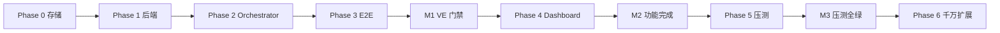

# cellp 文档库（仓库内部）

> **面向开发者 / YC 的产品文档（GitHub Pages）：**  
> **[https://konghayao.github.io/cellp/](https://konghayao.github.io/cellp/)**  
> 源码在 [`site/`](../site/)。使用者文档以站点为准，不要把本目录当 onboarding。
>
> 本目录是 **贡献者内部库**：设计、ADR、契约、验收门禁、证据。

> **设计入口：** [DESIGN.md](../DESIGN.md)  
> **决策摘要：** [decisions.md](./decisions.md)  
> **功能验收：** [test-plan.md](./test-plan.md)  
> **Agent 总则：** [../AGENTS.md](../AGENTS.md)

---

## 快速导航

| 我想… | 读这个 |
|--------|--------|
| **产品文档（如何用 cellp）** | **[GitHub Pages](https://konghayao.github.io/cellp/)** |
| 理解整体架构 | [DESIGN.md](../DESIGN.md) |
| 查当前有效决策（AD-1..10、D1、Bindings、存储 tier） | [decisions.md](./decisions.md) |
| 跑验收 / 看门禁 | [test-plan.md](./test-plan.md) |
| 本地起栈 | [../dev/README.md](../dev/README.md) · [../dev/INGRESS-HOST.md](../dev/INGRESS-HOST.md) · [../dev/AGENTS.md](../dev/AGENTS.md) |
| 改 Dashboard | [../web/AGENTS.md](../web/AGENTS.md) |
| 跑 E2E | [../e2e/README.md](../e2e/README.md) |
| 跑压测 | [../stress/README.md](../stress/README.md) · [phase6/README.md](../stress/phase6/README.md) |
| 查历史 VALIDATION 编号 | [../VALIDATION.md](../VALIDATION.md)（仅索引，执行以 test-plan 为准） |
| 从 Cloudflare / Vercel 迁移（产品文档） | [Pages: Migrate](https://konghayao.github.io/cellp/migrate/cloudflare) |
| 从 Cloudflare Workers 迁移（内部对照） | [cloudflare-migration.md](./cloudflare-migration.md) |
| 从 Vercel 迁移（内部对照） | [vercel-migration.md](./vercel-migration.md) |
| 生产回滚 | [runbooks/rollback.md](./runbooks/rollback.md) |
| 可观测性 | [observability.md](./observability.md) |
| 支持的技术栈 | [supported-stacks.md](./supported-stacks.md) |
| **社区 Workers 支持矩阵** | [support/README.md](./support/README.md)（索引）· [support-matrix.md](./support-matrix.md) · [support-unsupported-by-capability.md](./support-unsupported-by-capability.md) |
| **证据目录说明** | [evidence-index.md](./evidence-index.md)（`docs/evidence/` 本地 gitignore） |
| **Coding Agent on cellp（前沿）** | [plans/CODING-AGENT-ON-CELLP.md](./plans/CODING-AGENT-ON-CELLP.md) · [AGENT-SUPPORT.md](./AGENT-SUPPORT.md) |
| **Vercel framework on cellp（后续）** | [plans/VERCEL-FRAMEWORK-ON-CELLP.md](./plans/VERCEL-FRAMEWORK-ON-CELLP.md) · [VERCEL-SUPPORT.md](./VERCEL-SUPPORT.md) |
| Prod offshoot × RustFS | [runbooks/prod-offshoot-rustfs.md](./runbooks/prod-offshoot-rustfs.md) |

---

## 契约（冻结 · 修改需对抗审查）

| 文件 | 范围 | 状态 |
|------|------|------|
| [plans/D1-IMPORT-RPC.md](./plans/D1-IMPORT-RPC.md) | 根 version：`celld d1 import` CLI + HTTP | ✅ 已落地 |
| [plans/D1-BRANCH-RPC.md](./plans/D1-BRANCH-RPC.md) | 子 version：`celld d1 branch` CLI + HTTP | ✅ 已落地 |
| [plans/INGRESS-PORT-DEPLOYMENT.md](./plans/INGRESS-PORT-DEPLOYMENT.md) | AD-12 Tier B：`port_allocations`、稳定 prod 口 | 📋 P5 待实现 |
| [../cellp/api/openapi.yaml](../cellp/api/openapi.yaml) | REST API | ✅ TP-API-7 |

---

## 架构与审查

| 文件 | 内容 |
|------|------|
| [decisions.md](./decisions.md) | **当前有效**决策摘要（推荐首读） |
| [plans/REVIEW.md](./plans/REVIEW.md) | AD-1..5 对抗审查原文 |
| [plans/REVIEW-celld-d1-branch.md](./plans/REVIEW-celld-d1-branch.md) | D1 branch 对抗审查（APPROVE-WITH-CHANGES） |
| [plans/INGRESS-ROUTING.md](./plans/INGRESS-ROUTING.md) | AD-12 Host / Gateway |
| [plans/INGRESS-PORT-DEPLOYMENT.md](./plans/INGRESS-PORT-DEPLOYMENT.md) | AD-12 Port 台账与稳定 prod 口 |
| [plans/WEBSOCKET-SUPPORT-ANALYSIS.md](./plans/WEBSOCKET-SUPPORT-ANALYSIS.md) | **WebSocket 专题分析**（Gateway/DO/agent · M1/M2/M3） |
| [plans/WEBSOCKET-INGRESS-DESIGN.md](./plans/WEBSOCKET-INGRESS-DESIGN.md) | WS ingress 工程规格 v0.2 |
| [plans/FX-LLM-CREDENTIALS.md](./plans/FX-LLM-CREDENTIALS.md) | fx **仅 Vercel AI Gateway**；cellp 不做 OpenCode 适配 |

---

## 实施计划（按 Phase）

| Phase | 文件 | Gate | 状态 |
|-------|------|------|------|
| 0 | [phase-0-storage-gates.md](./plans/phase-0-storage-gates.md) | RustFS 探针 | V0a✅ V0b✅ |
| 1 | [phase-1-backend-core.md](./plans/phase-1-backend-core.md) | schema freeze | ✅ |
| 2 | [phase-2-orchestrator.md](./plans/phase-2-orchestrator.md) | AD-1 spike | ✅ |
| 3 | [phase-3-e2e.md](./plans/phase-3-e2e.md) | run-all | ✅ |
| 4 | [phase-4-dashboard.md](./plans/phase-4-dashboard.md) | M1 TP-VE-ALL | ✅ |
| 5 | [phase-5-stress.md](./plans/phase-5-stress.md) | M2 | 见 phase2 压测 |
| 6 | [phase-6-scale-10m-master.md](./plans/phase-6-scale-10m-master.md) | M3 / 6A | **6A 实现完成**（SQLite scope；6B–6F OUT OF SCOPE） |
| 7 | [phase-7-bindings.md](./plans/phase-7-bindings.md) | AD-6 · AD-7 | **已落地**（后端 E2E TP-V9–V16 · 2026-08-30）· Dashboard TP-UI track 1 |
| 8 | [phase-8-binding-branch.md](./plans/phase-8-binding-branch.md) | AD-8 | **已落地** — KV / R2 / Queue branch |
| 9 | [phase-9-version-archive.md](./plans/phase-9-version-archive.md) | AD-9 | **已落地** — archived / wake / 取消 5 ready 上限 |
| — | [decisions.md §15](./decisions.md#15-ad-10--产品边界权威否定与核心范畴) | AD-10 | **已落地** — 产品边界（账号/Git/链路/边缘否定 + 核心范畴） |

### v1 收尾（2026-08-29）

| 文件 | 说明 |
|------|------|
| [plans/v1-v0b-phase6-plan.md](./plans/v1-v0b-phase6-plan.md) | V0b PASS + Phase 6A 诚实交付范围 |

### D1 数据面（已完成 · 2026-08-29）

| 文件 | 说明 |
|------|------|
| [plans/celld-d1-branch.md](./plans/celld-d1-branch.md) | D1 branch 实施计划（T1–T5 完成） |
| [plans/D1-IMPORT-RPC.md](./plans/D1-IMPORT-RPC.md) | import 契约 |
| [plans/D1-BRANCH-RPC.md](./plans/D1-BRANCH-RPC.md) | branch 契约 |

> 已删除的过时计划：`celld-d1-binary-import.md`、`REVIEW-celld-d1-import.md`（import 已完成，以契约 + 证据为准）。

---

## 验收计划

| 文件 | 里程碑 | 用途 |
|------|--------|------|
| [test-plan.md](./test-plan.md) | **M1**（VE 门禁）· **M2**（全功能） | 一期主验收 |
| [test-plan-phase2.md](./test-plan-phase2.md) | **M3** | 生产压测 |
| [test-plan-phase6.md](./test-plan-phase6.md) | M6–M7 | 6A 完成（SQLite）；6B–6F OUT OF SCOPE |
| [test-plan-offshoot-branch-scale.md](./test-plan-offshoot-branch-scale.md) | TP-OB | offshoot 大库 CoW |

---

## 证据目录（`evidence/`）

运行前：`mkdir -p docs/evidence`  
临时文件 `*.log` / `*.out` 已 gitignore。  
**说明：** [evidence-index.md](./evidence-index.md) · 运行前 `mkdir -p docs/evidence`

### D1 数据面

| 证据 | 脚本 |
|------|------|
| [d1-import-scale-report.md](./evidence/d1-import-scale-report.md) | `stress/phase6/d1-import-scale.sh` |
| [d1-branch-e2e-report.md](./evidence/d1-branch-e2e-report.md) | `e2e/scripts/v1-d1-branch.sh` |
| [d1-branch-scale-report.md](./evidence/d1-branch-scale-report.md) | `stress/phase6/d1-branch-scale.sh` |
| [d1-branch-multi-100mb.json](./evidence/d1-branch-multi-100mb.json) | `e2e/scripts/v1-d1-branch-multi-100mb.sh` |

### 存储 / 架构

| 证据 | 说明 |
|------|------|
| [celld-multi-fleet-spike.md](./evidence/celld-multi-fleet-spike.md) | AD-1 多 upstream |
| [v0b-pass-report.md](./evidence/v0b-pass-report.md) | V0b offshoot × RustFS 全序列 PASS（2026-08-29） |
| [v0c-skip.md](./evidence/v0c-skip.md) | 多节点探针跳过 |
| [offshoot-branch-scale-report.md](./evidence/offshoot-branch-scale-report.md) | 大库 CoW（local） |
| [scale-report-6A.md](./evidence/scale-report-6A.md) | Phase 6A SQLite 基线 |
| [scale-env.json](./evidence/scale-env.json) | 压测环境拓扑 |

### 指标（append-only JSONL）

| 文件 | 来源 |
|------|------|
| [d1-import-metrics.jsonl](./evidence/d1-import-metrics.jsonl) | `d1-import-scale.sh` |
| [d1-branch-metrics.jsonl](./evidence/d1-branch-metrics.jsonl) | `d1-branch-scale.sh` |
| [d1-branch-multi-metrics.jsonl](./evidence/d1-branch-multi-metrics.jsonl) | multi-100mb |
| [scale-metrics.jsonl](./evidence/scale-metrics.jsonl) | phase6 聚合 |
| [stress-metrics.jsonl](./evidence/stress-metrics.jsonl) | phase5 压测 |

---

## 里程碑

| ID | 含义 | 解锁 |
|----|------|------|
| **M1** | 后端 + TP-VE-ALL | Dashboard 开工 |
| **M2** | test-plan 全绿 | 压测 |
| **M3** | test-plan-phase2 全绿 | 生产 sign-off |
| **M6–M7** | phase6 Gateway / 千万 | 6A 完成；**v1 prod path** 见 [scale-report-6F.md](./evidence/scale-report-6F.md)（完整 6F 仍 OUT OF SCOPE） |

---

## Subagent 派发约定

**Module root：** `cellp/` — 所有 Go 命令 `cd cellp && …`

**任务描述必含：**

1. Track ID（如 `P1-T2`）
2. 必读：[decisions.md](./decisions.md) AD-* + 对应 phase + test-plan TP 列表
3. Deliverables（路径 + 验证命令）
4. **禁止：** 改 `go.mod`（除非 deps owner）· PostgreSQL · Caddy · Forgejo · 修改冻结契约

**Dashboard 仅 `web/`** — Vite SPA，禁止引入 Next.js / SSR。

**本机运维（默认 subagent，勿让用户手跑）：** 本地栈、`deploy-support-app.sh`、curl 验收、`fix-rustfs-skew.sh` 等 → 派 **`coder`** 或 **`general-purpose`**（含 Bash）。**勿**派 `explorer`（只读、无 shell）。失败时主 agent 可直接 Bash 兜底。

---

*文档库 v1 · 2026-08-29 · cellp 首版交付定型*
