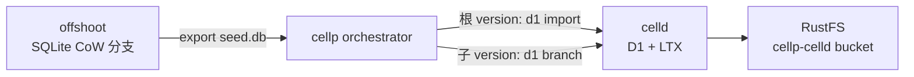

# cellp 架构决策记录

> **权威来源：** [plans/REVIEW.md](./plans/REVIEW.md)（AD-1..5 审查原文）  
> **设计背景：** [DESIGN.md](../DESIGN.md)  
> **最后更新：** 2026-08-30（含 AD-6 · AD-7 · AD-8 · AD-9 · **AD-10**）

本文档汇总**当前仍有效**的架构决策与冻结约束。计划文件中的历史讨论以本页 + 契约文件为准。

---

## 1. 平台边界

> **权威否定清单：** [§15 AD-10](#15-ad-10--产品边界权威否定与核心范畴)（2026-08-30，回应 CF/Vercel 采纳质疑）

| 决策 | 内容 |
|------|------|
| **私有化** | 100% 自建；不依赖 AWS / Cloudflare / Azure 等外部托管 SaaS |
| **Git / CI** | **外部边界**；GitHub / Forgejo / GitLab 等托管源码，CI 构建后 `POST /versions`；cellp **不做** Git 托管、仓库 Webhook、PR 集成 |
| **账号 / 租户** | **坚决不做**用户体系、Org、RBAC、SSO；仅 `DEPLOY_TOKEN` + `ADMIN_TOKEN`（见 AD-10） |
| **边缘 / 链路** | **不做**全球边缘 PoP、DNS、CDN、TLS 终止、WAF；入口由**外层其他项目**承担；cellp 提供**分布式**控制面 + Gateway 反代 |
| **Registry** | SQLite（`cellp-registry.sqlite`，WAL）；**不用 PostgreSQL** |
| **Gateway** | cellpd **内置** reverse proxy；监听 HTTP，由外部 LB 反代并终止 TLS |
| **一期范围** | CD + Branch + Version + promote/saga；ready 数量**无硬上限**（AD-9，靠封存回收进程） |
| **Bindings（本期）** | 沿用 celld 0.4.0；子 version **D1+KV+R2+Queue branch**（AD-8）；Workflow/Cron/Worker 不 branch |

---

## 2. AD-1 — 每 Version 独立 celld upstream

**问题：** celld 官方限制「1 fleet = 1 deploy」；单进程无法同时服务不同 artifact 的多个 version。

**决策：**

| 项 | 实现 |
|----|------|
| celld | 每个 **ready version** 独立子进程 + 独立端口（`8792+N`） |
| bucket | `s3://cellp-celld/{project}/{version}` 每 version 隔离 |
| Registry `routes` | 每 version 记录 `upstream_host` + `upstream_port` |
| Gateway | `/{project}/{version}/*` → 查 route → reverse proxy |
| 本地 watch | **默认临时目录**（`$TMPDIR/cellp-celld-*`）；进程 `Stop` 后删除。**S3/RustFS 为唯一持久层** |
| 调试 | `CELLP_CELLD_WATCH_PERSIST=1` 恢复 `dev/data/celld-watch/{project}/{version}` 持久路径 |

**证据：** `docs/evidence/celld-multi-fleet-spike.md` · `e2e/scripts/v3-dual-route.sh` · `e2e/scripts/v1-d1-branch.sh`（B5 S3-only restore）

**D1 branch 含义：** 优化的是 **S3/RustFS 对象体积**（子 bucket 存 `base.json` + 增量 LTX）。本地 watch 仅为 SQLite 执行时的**可丢弃页缓存**；branch 不再依赖本地副本做隔离或恢复。

---

## 3. AD-2 — Gateway prod 路径为一期必交付

`GET|POST|… /{project}/*` → 当前 `prod_version_id` 的 upstream。Phase 1 exit criterion，非可选。

**证据：** `e2e/scripts/v4-promote-cutover.sh` · `ve-promote.sh`

---

## 4. AD-3 — Orchestrator job 持久化

SQLite 表 `jobs` + lease；cellpd 重启可恢复 pending job。Phase 1 schema 预留，Phase 2 实现 pickup。

---

## 5. AD-4 — offshoot 部署 tier

| Tier | offshoot store | 门禁 |
|------|----------------|------|
| **Dev / 功能验收** | local dir | `test-plan` 可全绿（M2） |
| **Prod 数据面** | RustFS `s3://cellp-offshoot` | **TP-V0b 必须**（✅ 2026-08-29，见 [evidence/v0b-pass-report.md](./evidence/v0b-pass-report.md)） |

**注意：** M2 全绿 ≠ prod offshoot 已上 RustFS。压测报告须注明 `offshoot_tier`。

---

## 6. AD-5 — Promote saga（自动补偿）

```
forward:  validate → drain_old → deactivate_old_route → offshoot_promote → CAS_prod → activate_prod_route
compensate: 任一步失败按逆序 idempotent 回滚
```

Registry 必交付 `SetProdVersionCAS(project, expected, new)`。

**证据：** `e2e/scripts/v5-saga-compensate.sh`

---

## 7. D1 数据面（已完成）

### 7.1 分层职责



| 层 | 职责 | 不做什么 |
|----|------|----------|
| **offshoot** | App+Data 分支、export SQLite | celld **不**直接读 offshoot store |
| **cellp** | fork → deploy → 选择 import vs branch | 不把 SQLite 字节放进 API JSON |
| **celld** | LTX 复制、restore、Worker D1 binding | 同一进程不托管多 version（AD-1） |

### 7.2 D1 import（根 version / 首次 seed）

- **契约：** [plans/D1-IMPORT-RPC.md](./plans/D1-IMPORT-RPC.md)（**冻结**）
- **CLI：** `celld d1 import DATABASE --file PATH …`
- **HTTP：** `{ "import": { "path": "/abs/seed.db" } }` — **仅 path**，禁止 `bytes` / `base64` / `sql`
- **cellp：** `orchestrator` 在根 version 走 offshoot export → `D1Execute(import)`

**证据：** `docs/evidence/d1-import-scale-report.md` · `e2e/scripts/v1-d1-seed.sh`

### 7.3 D1 branch（子 version / 共享父 LTX）

- **契约：** [plans/D1-BRANCH-RPC.md](./plans/D1-BRANCH-RPC.md)（**冻结**）
- **CLI：** `celld d1 branch DATABASE --parent-bucket URI --bucket CHILD_URI`
- **HTTP：** `{ "branch": { "parent_bucket": "s3://…", "parent_epoch": N } }`
- **机制：** 子 bucket 写 `base.json` 指向父 LTX 前缀；restore 先读父到 `fork_txid` 再叠子增量
- **cellp：** `parent_version_id` 非空且父 `ready` → `D1DeployPlanForVersion` → 跳过 export，走 `D1Branch`

**否决捷径（仍有效）：**

- `fs::copy` 父 `db.sqlite` 到子 watch
- 子 version 再跑全量 `d1 import`（对象层退化为 N× 全量 snapshot）
- JSON 里塞 SQLite 字节
- celld 打开 offshoot checkout 当 D1 VFS

**证据：**

| 场景 | 脚本 | 报告 |
|------|------|------|
| 8 MB e2e | `e2e/scripts/v1-d1-branch.sh` | `docs/evidence/d1-branch-e2e-report.md` |
| 8 MB 对象体积 | `stress/phase6/d1-branch-scale.sh` | `docs/evidence/d1-branch-scale-report.md` |
| 100 MB × 3 分支 | `e2e/scripts/v1-d1-branch-multi-100mb.sh` | `docs/evidence/d1-branch-multi-100mb.json` |

**实测（100 MB × 3 sibling）：** S3 cells 合计 ~104 MiB vs 朴素全量复制 ~400 MiB（~74% 节省）；sibling 交叉可见性 0。

### 7.4 wrangler 约束

- 一期每 bundle **一个** `d1_databases[]` binding
- 子 version **必须继承父 `database_id`**（否则 LTX scope 哈希不同，branch 无效）
- `D1Execute` 在 0 个 `d1_databases` 时跳过

---

## 8. 存储准入（Phase 0）

| 探针 | 命令 | 状态 |
|------|------|------|
| **V0a** celld × RustFS 条件写 | `e2e/scripts/v0a-celld-diagnose.sh` | ✅ |
| **V0b** offshoot branch × RustFS 全序列 | `e2e/scripts/v0b-offshoot-rustfs.sh` | ✅（[v0b-pass-report.md](./evidence/v0b-pass-report.md) · 2026-08-29） |
| **V0b-L** 大库 fork | `stress/phase6/offshoot-branch-scale.sh` | ✅ local tier |
| **V0c** 多节点条件写 | 单一 VIP 可跳过 | ✅ skip 文档 |
| **V0d** offshoot attach | `e2e/scripts/v0d-offshoot-attach.sh` | ✅ |

**RustFS：** 默认 S3 后端；`celld diagnose` 通过前 **不得**启动 fleet。

---

## 9. 仓库模块与修改边界

| 路径 | 用途 | Agent 注意 |
|------|------|------------|
| `cellp/` | Go 控制面（API · Orchestrator · Gateway · Registry） | module root；`cd cellp && go test ./...` |
| `celld/` | Rust 运行时（git submodule） | 改 D1/LTX 后 `cargo build -p celld --profile lab` 并重装 |
| `web/` | Dashboard（Vite + React） | **仅消费** `:8790` API；禁止直连 `:8792` / offshoot / S3 |
| `dev/` | 本地栈脚本 | `up.sh` / `health.sh` / `simulate-cd.sh` |
| `e2e/` | 端口级集成验收 | `run-all.sh` = M1/M2 门禁 |
| `stress/` | 压测 harness | phase5 = 生产压测；phase6 = 千万扩展 / D1 scale |

**禁止：** 引入 PostgreSQL · Caddy/Forgejo 作为 cellp 依赖 · 外部云对象存储 · 手改 `dev/data/` 状态。

---

## 10. 文档变更规则

| 类型 | 修改方式 |
|------|----------|
| **冻结契约**（`D1-*-RPC.md`） | 需新 ADR + 对抗审查；禁止静默改字段 |
| **架构决策**（AD-*） | 更新本文件 + `plans/REVIEW.md` |
| **验收状态** | 更新 `test-plan.md` + `docs/evidence/` |
| **实施计划**（已完成） | 保留只读；状态标「已完成」 |

---

## 11. AD-6 — Worker 绑定沿用 celld 0.4.0

**问题：** Worker 绑定（KV · Queue · Workflow · R2 · Cron）需要与 celld 运行时对齐。celld **v0.4.0**（2026-08-28）已原生支持 `kv_namespaces`、`queues`、`workflows`、`r2_buckets`，并提供 `celld kv` / `celld queue` / `celld cell list`。

**决策：**

| 项 | 实现 |
|----|------|
| Worker KV / Queue / Workflow / R2 / Cron | **celld 运行时**；`celld deploy` 原样消费 wrangler |
| cellp | 解析 wrangler 出 bindings 清单；**包装已有 CLI**（与 D1 相同：cellpd → `celld … --bucket version-bucket`） |
| Dashboard | 只打 `:8790`；Storage 升级为 Bindings hub |

废弃 Version 字段 `kv_prefix` · `inherit_kv`（若 API 仍存在则忽略）。

**不做：** 自研 queue broker；把 KV 写进 Registry；Dashboard 直连 celld。

**完整规格：** [DESIGN.md §8](../DESIGN.md)

**依据：** `celld/docs/cloudflare-compat.md` · `celld/crates/celld/kv_cli.rs` · `queue_cli.rs`

---

## 12. AD-7 — 无 branch 的绑定空起步（等到 celld 支持再 inherit）

**问题：** D1 有 `celld d1 branch`（子 bucket 指父 LTX）。KV / R2 / Queue / Workflow **没有** 等价命令。若 preview 去读父 version 的 bucket，会破坏 AD-1 隔离，也可能写穿 prod。

**决策：**

| 绑定 | 子 version 数据 | 本期 |
|------|-----------------|------|
| **D1** | `d1 branch`（已落地） | 保持 |
| **KV / R2 / Queue / Workflow** | **空**（独立 `s3://cellp-celld/{project}/{version}`） | **不做 copy / 挂父桶 / inherit** |
| R2 对象浏览器 | 无 `celld r2` | **不做管理面**（清单可见） |
| Workflow 控制 | 无 `celld workflow` | **只读** `cell list` |

等 celld 提供这些资源的 branch / operator CLI 后，**新 ADR** 再开 inherit 专项。产品必须在 UI 标明 preview KV/Queue 不携带 prod 数据。

**修正（2026-08-30）：** AD-8 落地后，KV / R2 / Queue **不再**空起步。AD-7 仅保留 **Workflow 实例**（及 Worker 脚本 / Cron：本就不是可 fork 的数据集）。

---

## 13. AD-8 — KV / R2 / Queue 跨 version branch

**问题：** 子 version 独立 bucket（AD-1）导致 preview 看不到父 KV/R2/Queue。cellp 不得 CopyObject / 循环 dump。

**决策：** 在 celld 对象层做与 D1 同构的 branch（LTX `base.json` + chained restore；KV 大 value 链式读父 `kv/blobs-v2`；R2 前缀 overlay + 墓碑）。cellp 只包装 CLI。一层 fork。身份继承父 wrangler。Worker / Workflow / Cron **不** branch。

**计划：** [phase-8-binding-branch.md](./plans/phase-8-binding-branch.md)

---

## 14. AD-9 — Version archived 与取消 ready 上限

**问题：** `ready` 绑定活进程；promote 只关路由不 Stop；5 槽 429 阻碍快速 CD。

**决策：**

- 新状态 `archived`：Stop 进程、删 watch、route 关、**保留 S3**；可当 branch 父
- **删除**每 project 5 ready 硬上限
- 永不 archive prod；grace 15m；idle 45m；promote 后旧 prod 热留 60m 再交 idle
- 第一期 Gateway 对 archived 回 503，显式 `POST wake`，不同步 wake

**计划：** [phase-9-version-archive.md](./plans/phase-9-version-archive.md)

---

## 15. AD-10 — 产品边界（权威否定与核心范畴）

**背景：** 外部审查常以 Cloudflare / Vercel 默认能力衡量 cellp。下列为**冻结的产品边界**——不是 roadmap 缺口，而是刻意不做；后续 issue/PR 不得静默越界。

### 15.1 坚决不做账号体系

| 项 | 决策 |
|----|------|
| 用户 / Org / Team | **不做**注册、登录、OAuth、SSO、多租户 |
| 鉴权 | 仅 **`DEPLOY_TOKEN`**（`POST /versions`）与 **`ADMIN_TOKEN`**（其余 API + Dashboard） |
| 管理维度 | **Project + Version**；无「谁部署了」审计归属（除非外层系统记录 token 使用） |
| Dashboard | **不做**权限 UI、角色切换、成员邀请 |

多租户、RBAC、审计归属若需要，由**生态外层项目**实现，或**永远不在 cellp 范围内**。

### 15.2 不做全球边缘；分布式能力即可

| 项 | 决策 |
|----|------|
| 目标形态 | **私有化分布式**部署（多 cellpd 节点、RustFS 集群、每 version 独立 celld），非 Cloudflare 式全球 PoP |
| 二期「多节点」 | 控制面与运行时**水平扩展**、路由缓存；**不是** CDN 边缘、不是 Anycast |
| 延迟预期 | 不承诺「用户就近边缘」；承诺 version 隔离、preview/prod 路由、数据 branch |

### 15.3 不做 DNS / CDN / TLS / WAF 等链路层

| 项 | 决策 |
|----|------|
| cellp Gateway | HTTP reverse proxy：`/{project}/` · `/{project}/{version}/` → celld upstream |
| TLS / 域名 / WAF / DDoS | **外层项目**（Nginx、云 LB、自有网关、Zero Trust 代理等）终止 TLS 并防护 |
| 依赖 | **不引入** Caddy、不内置 ACME、不管理 DNS 记录 |

cellp 只暴露 Gateway 端口；公网形态由部署方拼装。

### 15.4 不做 Git；外部平台推送版本

| 项 | 决策 |
|----|------|
| 源码托管 | GitHub · Forgejo · GitLab 等**外部**；cellp **不** clone、不托管仓库、不跑 Git 服务 |
| 版本入口 | 外部 CI 构建 wrangler bundle → 上传 artifact → **`POST /v1/projects/{id}/versions`** |
| 元数据 | `git_ref` / `git_sha` 仅为 version **标签**，不驱动路由、不自动 promote |
| 集成形态 | Webhook / Actions / Forgejo CI **在外部**触发；cellp 只收 HTTP API |

**禁止**将 Forgejo / GitHub App 列为 cellp 运行时依赖（见 AGENTS.md）。

### 15.5 cellp 核心范畴（做什么）

cellp 是 **Workers 平台控制面**：在每次 CD 时 version 化 **App + Data**，并提供 preview / prod 切流。

| # | 核心能力 | 模块 |
|---|----------|------|
| 1 | **Version 生命周期** | pending → ready → archived → destroyed；poll API |
| 2 | **App + Data 同版** | offshoot fork/export；D1 import / branch（AD-1 · D1 契约） |
| 3 | **Binding 数据 branch** | 子 version：D1 + KV + R2 + Queue（AD-8）；Workflow/Cron/脚本不 branch |
| 4 | **运行时隔离** | 每 ready version 独立 celld + bucket（AD-1） |
| 5 | **Gateway 路由** | preview `/{project}/{version}/`；prod `/{project}/`（AD-2） |
| 6 | **Promote 切流** | drain · offshoot promote · CAS prod · saga 补偿（AD-5） |
| 7 | **Bindings 运维 API** | wrangler 清单；KV / Queue / D1 operator；Workflow 只读 |
| 8 | **Worker env** | per-version 覆盖 → `CELLD_VARS_FILE`；`GET/PUT …/env` |
| 9 | **Registry** | SQLite：project、version、route、prod 指针、jobs |
| 10 | **Dashboard** | 项目 · 部署 · 存储 · Settings env；**仅**消费 `:8790` API |

**不是 cellp：** 自托管 Cloudflare、自托管 Vercel、PaaS 托管、Git 平台、账号中心、边缘 CDN。

**证据与契约：** `DESIGN.md` · `D1-*-RPC.md` · `test-plan.md` TP-V* / TP-UI-*

