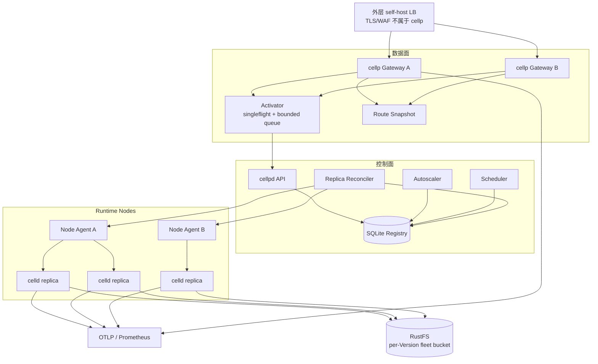
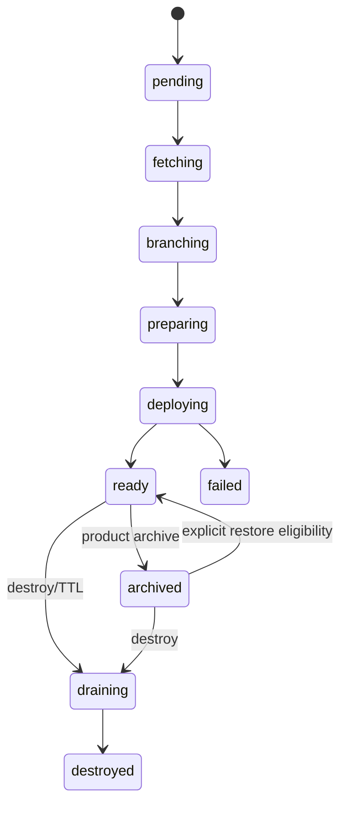
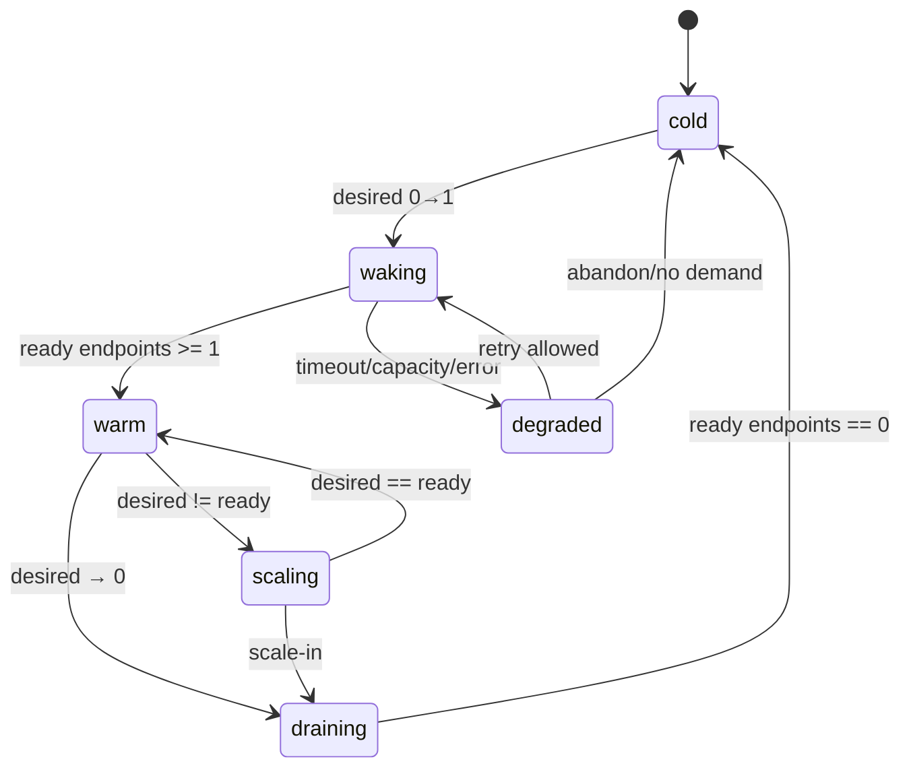
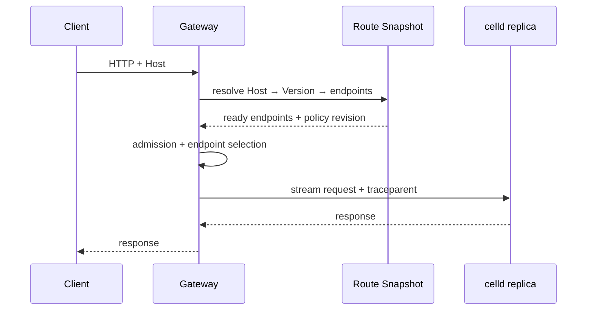
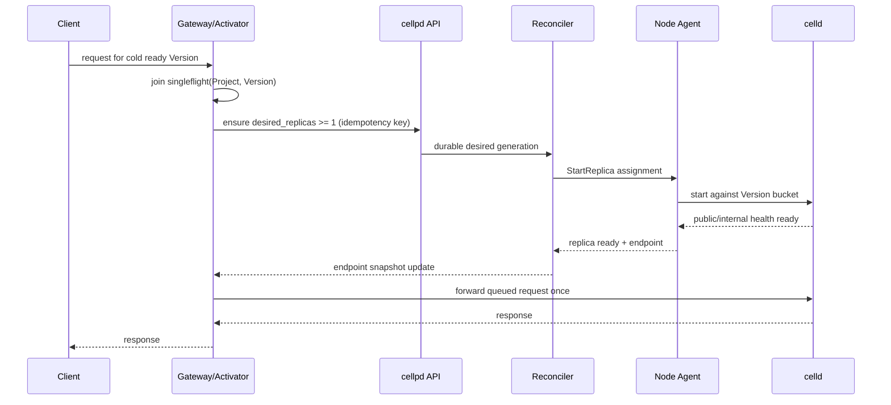

# Self-hosted Serverless 洪峰与弹性运行时设计

> **状态：** Draft · 未生效 · 待对抗审查  
> **日期：** 2026-09-04  
> **范围：** cellp 二期弹性（VALIDATION V8 / V12）  
> **影响：** 若采纳，需新增架构决策并修订 AD-1、AD-9；本文不直接修改任何冻结契约  
> **相关：** [DESIGN.md](../../DESIGN.md) · [decisions.md](../decisions.md) · [phase-9-version-archive.md](./phase-9-version-archive.md) · [OTEL-OBSERVABILITY.md](./OTEL-OBSERVABILITY.md) · [celld guarantees](../../celld/docs/guarantees.md)

---

## 0. 一句话决策

将 cellp 从：

```text
ready version = 一个长期存活的 celld 进程
```

演进为：

```text
Version = 可持久恢复的 App + Data 部署
Serving Fleet = 该 Version 临时拥有的 0..N 个 celld replica
```

长尾 Version 可缩到零；热点 Version 可在自有节点上水平扩展；Gateway 负责冷启动激活、有界排队和流量分发；Autoscaler 与 Scheduler 负责扩缩容和资源保护；RustFS 仍是唯一持久层。

这是一套 **100% self-hosted** 的 Serverless 弹性机制。设计可借鉴 Knative Activator、Cloud Run concurrency、Lambda provisioned concurrency、KEDA/HPA stabilization 等算法，但不得把公有云服务、Knative、KEDA、Kubernetes、Redis、PostgreSQL 或外部消息队列变成 cellp 依赖。

---

## 1. 背景与问题

### 1.1 当前模型

当前有效 AD-1 将每个 `ready` Version 映射为：

- 独立 celld 子进程；
- 独立监听端口；
- 独立 `s3://cellp-celld/{project}/{version}` bucket；
- 独立、可删除的 `CELLD_WATCH` 页缓存；
- Registry 中单条 `Route`，只包含一个 upstream。

AD-9 通过 `archived` 停止 celld、删除 watch、关闭 route，同时保留 RustFS 数据，并取消每 Project 5 个 ready Version 的硬上限。

这解决了版本隔离和 CD 上限问题，但在高频部署场景形成结构性资源浪费：

1. 没有流量的 `ready` Version 仍长期占用一个 V8/celld 进程；
2. 时间型 idle reaper 不能对突发部署、宿主机 RSS 压力快速响应；
3. `ready` 同时承担“部署可用”和“进程在线”两种语义；
4. 单 Version 只有一个 upstream，生产流量洪峰无法横向扩展；
5. Gateway 对 archived 只返回 503，不能由首请求自动激活；
6. promote 后新 prod 可能以单个冷进程承接全部流量。

### 1.2 要解决的五类洪峰

| 类型 | 触发 | 当前失败模式 | 本设计响应 |
|------|------|--------------|------------|
| HTTP 洪峰 | 单个 prod/preview 的 RPS、并发或延迟突增 | 单 upstream 饱和、排队、5xx | `1 → N` 扩容、并发准入、背压 |
| 冷启动洪峰 | 冷 Version 突然被并发访问 | 每请求独立 wake、启动风暴、Gateway OOM | Activator singleflight、有界队列、`0 → 1` |
| CD/Version 洪峰 | 短时间创建大量 Version | celld 进程和 RSS 随 ready 数线性增长 | Version/Serving 解耦、pressure scale-in、preview 优先归零 |
| Promote 洪峰 | prod 指针切换后流量瞬时进入新 Version | 新 Version 未预热、旧 Version 过早释放 | readiness gate、可选预热、旧 prod drain/rollback reserve |
| 集群容量洪峰 | 所有 runtime node 接近 CPU/RSS 极限 | OOM、全局雪崩 | 优先级、资源预算、load shedding、有界 503 |

### 1.3 成功定义

本设计成功不等于“永不返回 503”，而是：

- 平时长尾 Version 不占常驻进程；
- 有容量时，热点 Version 可快速获得更多 replica；
- 无容量时，系统按明确优先级降级，不因无限排队或 OOM 全站崩溃；
- 已确认成功的持久写仍遵守 celld 的 fencing 与 RPO=0 保证；
- 控制面短暂不可用时，已运行的数据面继续基于最后有效路由快照服务；
- 所有扩缩容行为可观测、可解释、可审计原因。

---

## 2. 范围与硬约束

### 2.1 In scope

- HTTP 请求驱动的 scale-from-zero；
- 单 Version 的 `0..N` celld replica；
- self-host runtime node 发现、心跳、容量上报和调度；
- Gateway endpoint set、负载均衡、准入、熔断、有界冷启动排队；
- 按并发、队列、延迟与资源压力扩缩；
- prod、preview、previous prod、pinned Version 的优先级策略；
- drain、优雅停止、故障恢复、幂等 controller；
- 与 AD-5 promote saga、AD-9 archive/wake、AD-11 Cron、AD-14 OTEL 的对接；
- SQLite 作为第一阶段控制面持久存储；
- 本机模式和多宿主机模式使用相同抽象。

### 2.2 Out of scope

遵守 AD-10，下列不属于 cellp：

- DNS、CDN、TLS 终止、WAF、DDoS 清洗、全球 PoP/Anycast；
- 用户、Org、RBAC、SSO、多租户计费；
- Git 托管和 CI；
- 自动采购公有云实例；
- 自研对象存储、消息队列或可观测搜索引擎；
- PostgreSQL、Redis、Caddy、Forgejo 作为核心依赖；
- 对无限容量或零冷启动作虚假承诺。

外层自有 LB、Nginx、硬件负载均衡器、K8s 或 VM 平台可以存在，但 cellp 核心不能依赖其中任意一种。

### 2.3 不变约束

1. 管理维度仍是 `Project + Version`。
2. 不同 Version 继续使用独立 bucket；禁止跨 Version 共用可写 bucket。
3. D1 import/branch 冻结契约不因本设计修改。
4. 本地 `CELLD_WATCH` 仍是可丢弃缓存，RustFS 是唯一持久层。
5. 生产启动前仍必须运行 `celld diagnose` 存储探针。
6. Gateway/Dashboard 不直连 RustFS 或 celld operator API。
7. 内部 celld listener 不得暴露公网。
8. 已被上游接收的非幂等请求不得由 Gateway 猜测性重放。

---

## 3. 术语

| 术语 | 定义 |
|------|------|
| Version | 不可变 artifact、bindings 配置、Version bucket 和元数据组成的部署单元 |
| Serving Fleet | 为一个 Version 服务的 celld replica 集合；所有 replica 指向该 Version 的同一 bucket |
| Replica | 一个具体 celld 进程实例，身份至少包含 `replica_id + node_id + generation` |
| Runtime Node | 可运行 celld replica 的 self-host 机器、VM 或 Pod |
| Node Agent | 每个 Runtime Node 上负责启动、停止、探测和上报 celld 的受控代理 |
| Endpoint | Gateway 可转发到的健康 replica 地址，仅指 public Worker listener |
| Activator | Gateway 中处理冷 Version 请求合并、激活和有界等待的模块 |
| Autoscaler | 根据需求与策略计算 `desired_replicas` 的 controller |
| Scheduler | 将待启动 replica 放置到 Runtime Node 的 controller |
| Reconciler | 将声明状态与实际状态最终收敛的 controller |
| Cold | Version 已 ready，但没有可服务 endpoint |
| Warm | 至少一个 ready endpoint 可服务 |
| Drain | endpoint 不再接收新请求，等待已接收工作结束并安全停止 |
| Surge reserve | 预留但未被稳态负载占用、用于洪峰的自有算力 |

---

## 4. 核心设计原则

### 4.1 Version 与计算资源解耦

`ready` 只表示 Version 已通过部署、数据准备、migration 和健康资格验证，能够被启动；不再隐含“存在活进程”。

`archived` 继续表示面向产品的历史封存：默认不自动激活，适合长期历史 Version。日常 scale-to-zero 使用 Serving 状态 `cold`，不能滥用 `archived`。

### 4.2 声明式、幂等、最终一致

Autoscaler 只写 `desired_replicas`；Scheduler 创建 replica assignment；Node Agent 执行；Reconciler 根据 generation 收敛。每层必须可重复执行，cellpd 重启后可恢复。

### 4.3 数据面不依赖每请求查 SQLite

Gateway 热路径使用内存中的不可变 Route Snapshot：

```text
Host/listen port → Project + Version → endpoint set + serving policy revision
```

SQLite 是控制面事实来源，不是请求路径数据库。控制面故障时，Gateway 可以继续使用最后一份有效快照。

### 4.4 快扩慢缩

- 扩容追求尽快消化 backlog；
- 缩容要求稳定窗口、drain 和最小存活时间；
- 任何情况下不得通过无限排队掩盖容量不足。

### 4.5 自有容量是硬边界

Self-host 不存在凭空出现的实例。Autoscaler 的 `desired` 只是需求，`scheduled/ready` 才是实际能力。两者差值必须成为一等指标，并触发明确的 overload 行为。

### 4.6 安全优先于自动化

Node Agent 只能接收已认证、限定作用域的生命周期命令；不得通过 API 回传 secrets、完整环境变量或 bucket credential；celld 内部 listener 仅在可信私网或加密 overlay 内可达。

---

## 5. 目标架构



### 5.1 逻辑组件不等于独立服务

第一阶段中，Activator、Autoscaler、Scheduler、Reconciler 可以仍位于一个 `cellpd` 二进制中；Node Agent 本机实现可以是现有 `runtime.Manager` 的适配层。逻辑边界必须先清晰，物理拆分留到多节点阶段。

### 5.2 推荐职责边界

| 组件 | 负责 | 不负责 |
|------|------|--------|
| Gateway | Host 路由、endpoint 选择、inflight、超时、熔断 | 修改 Version、直接启停进程 |
| Activator | 冷请求合并、触发 wake、短时有界等待 | 长期消息持久化、请求无限排队 |
| Autoscaler | 计算 desired、稳定窗口、优先级 | 直接 fork 进程、分配端口 |
| Scheduler | placement、资源和反亲和约束 | 计算业务负载需求 |
| Reconciler | assignment 与实际 replica 收敛 | 处理用户 HTTP body |
| Node Agent | 本机进程、watch、端口、health、drain | 全局调度、跨 Version 决策 |
| Registry | 声明状态和租约持久化 | Gateway 每请求查询 |
| RustFS | fleet 持久数据与 celld ownership/fencing | 控制面请求排队 |

---

## 6. 双状态模型

### 6.1 Version 生命周期

建议最终收敛为：



Version 状态语义：

| 状态 | 持久数据 | 是否允许启动 Serving Fleet |
|------|----------|----------------------------|
| `ready` | 保留 | 是，受 policy 控制 |
| `archived` | 保留 | 默认否；必须显式 wake/restore |
| `draining` | 等待销毁 | 否，不创建新 replica |
| `destroyed` | 已删除或进入删除流程 | 否 |
| `failed` | 只保留诊断所需内容 | 否 |

### 6.2 Serving 生命周期

Serving 状态为派生状态，不复用 `versions.status`：



建议派生规则：

```text
cold      = desired=0 && ready=0 && starting=0
waking    = desired>0 && ready=0 && starting>0
warm      = ready>0 && desired=ready && no blocking error
scaling   = ready>0 && desired!=ready
 draining = terminating>0
 degraded = desired>ready && last_scale_error is recent
```

不得依赖手工写 `serving_state` 维持真相；它应由 replica/assignment 汇总得到，必要时只缓存。

### 6.3 Replica 生命周期

```text
requested → assigned → starting → ready → draining → stopped
                    ↘ failed       ↘ lost
```

每次 replacement 创建新 `replica_id`。禁止复用旧进程身份；`generation` 防止迟到的 Agent 响应覆盖新状态。

---

## 7. 数据模型草案

> 本节是逻辑 schema，不是已批准 migration。第一阶段继续使用 SQLite/WAL，不引入 PostgreSQL。

### 7.1 `serving_policies`

每个 Version 一行；未显式配置时由 `preview/prod/background bindings` 默认策略生成。

| 字段 | 类型 | 含义 |
|------|------|------|
| `project_id` | TEXT | 联合主键 |
| `version_id` | TEXT | 联合主键 |
| `revision` | INTEGER | 乐观并发与 Gateway snapshot 版本 |
| `min_replicas` | INTEGER | 最小常驻 replica |
| `max_replicas` | INTEGER | 最大 replica |
| `target_concurrency` | INTEGER | 每 replica 目标 inflight |
| `hard_concurrency` | INTEGER | 每 replica 硬并发上限 |
| `idle_timeout_sec` | INTEGER | 可缩零前的无流量时间 |
| `scale_down_window_sec` | INTEGER | 缩容稳定窗口 |
| `startup_timeout_sec` | INTEGER | replica 启动 deadline |
| `priority_class` | TEXT | `prod` / `previous_prod` / `pinned` / `preview` |
| `allow_scale_to_zero` | BOOL | 是否允许归零 |
| `background_mode` | TEXT | `none` / `resident_required` / 未来 `event_activator` |
| `updated_at` | TIMESTAMP | 配置更新时间 |

约束：

```text
0 <= min_replicas <= max_replicas
1 <= target_concurrency <= hard_concurrency
max_replicas <= operator cluster limit
background_mode=resident_required => min_replicas>=1
```

### 7.2 `serving_desires`

Autoscaler 的声明状态：

| 字段 | 含义 |
|------|------|
| `project_id/version_id` | 主键 |
| `desired_replicas` | 当前需求 |
| `reason` | `cold_start` / `concurrency` / `latency` / `manual` / `pressure` / `promote` |
| `observed_policy_revision` | 计算时使用的 policy revision |
| `generation` | 每次 desired 变更递增 |
| `valid_until` | 防止控制面死亡后永久维持瞬时 burst desired |
| `updated_at` | 更新时间 |

`valid_until` 过期时不得立即杀死全部进程；Reconciler 回落到 `min_replicas` 并执行 drain。

### 7.3 `runtime_nodes`

| 字段 | 含义 |
|------|------|
| `node_id` | 稳定、operator 配置的节点 ID |
| `agent_addr` | 私网 Agent 地址 |
| `zone` | 可选故障域标签，不代表公有云 zone |
| `capacity_cpu_millis` | 可调度 CPU |
| `capacity_memory_bytes` | 可调度内存 |
| `allocatable_*` | 扣除保留后的容量 |
| `used_*` | Agent 观测值 |
| `state` | `ready` / `cordoned` / `draining` / `lost` |
| `heartbeat_at` | 最近心跳 |
| `labels_json` | 硬件/架构/用途标签，值需做长度限制 |
| `agent_generation` | Agent 重启代次 |

### 7.4 `runtime_replicas`

| 字段 | 含义 |
|------|------|
| `replica_id` | 随机不可猜身份 |
| `project_id/version_id` | 所属 Version |
| `node_id` | placement |
| `generation` | assignment 代次 |
| `state` | Replica 生命周期 |
| `public_host/public_port` | Worker listener，仅 Gateway 私网可达 |
| `internal_addr` | celld internal listener，仅 Agent/peer 私网可达；不得进公开 API |
| `watch_path_ref` | 仅 Node Agent 内部引用；不得返回给 API |
| `started_at/ready_at/draining_at` | 生命周期时间 |
| `last_heartbeat_at` | 存活判断 |
| `last_error_code` | 低基数错误码，不存 secrets/完整命令行 |

### 7.5 `routes` 演进

当前 `Route` 是一 Version 一 upstream。目标模型需改为：

```text
IngressBinding → RouteTarget(Project, Version)
RouteTarget    → EndpointSet[Replica]
```

可以增加 `route_snapshots` 或直接由 `runtime_replicas(state=ready)` 构建 endpoint set。原 `routes.upstream_host/upstream_port` 在兼容期保留为单 replica 投影，不再是多副本事实来源。

### 7.6 SQLite 并发边界

第一阶段必须限制写放大：

- Gateway 不逐请求写 inflight 到 SQLite；指标只在内存/OTLP/Prometheus；
- Node heartbeat 合并后写，禁止每秒每 replica 一事务；
- Autoscaler 只在 desired 实际变化时落库；
- Route Snapshot 用 revision/变更通知或低频 reconcile；
- 多 cellpd 写入前必须先完成 V12 对 SQLite 单写 ownership 的设计，不能假设 WAL 等于分布式共识。

---

## 8. 默认 Serving Policy

建议保守默认值；最终数值必须由压测确定，不能直接视为上线参数。

| 场景 | min | max | scale-to-zero | idle | priority |
|------|----:|----:|---------------|------|----------|
| 普通 preview（HTTP-only） | 0 | 2 | 是 | 5m | preview |
| pinned preview/QA | 1 | 2 | 否 | — | pinned |
| prod（HTTP-only，第一阶段） | 1 | 10 | 否 | — | prod |
| previous prod rollback reserve | 1 | 2 | 否，保留期后降为 preview | 60m | previous_prod |
| 含 Cron/Queue/Workflow/alarm 的 prod | >=1 | 依容量 | 否 | — | prod |
| 含后台事件的 preview | 0，且默认不 arm | 2 | 是 | 5m | preview |
| archived | 0 | 0 | 否（显式 wake 后先恢复为 ready） | — | archive |

### 8.1 为什么 prod 第一阶段不默认归零

- 避免未成熟的冷启动路径直接成为生产默认；
- 保留 Cron/Queue/Workflow/Alarm 的后台执行者；
- 允许先独立验证 preview `0 → 1`；
- Self-host 常见生产场景可接受每个 prod 至少一个 replica，同时避免所有历史 Version 常驻。

prod `min_replicas=0` 必须是显式 opt-in，且只有 `background_mode=none`、冷启动门禁通过时可设置。

### 8.2 Pin 语义调整

当前 `Pinned` 阻止 archive。新模型中建议解释为：

```text
Pinned = 不被 pressure eviction 且 min_replicas 至少为 operator 指定值
```

如果只需要保留历史数据而不需常驻计算，应使用普通 `ready/cold` 或 `archived`，不能滥用 pin。

---

## 9. HTTP 请求路径

### 9.1 Warm path



要求：

- 不同步查 SQLite；
- 请求 body 默认流式转发，不为重试缓存；
- Gateway 维护每 endpoint 的 inflight、近期延迟、失败窗口；
- endpoint 在 snapshot 选择后进入 drain 时，已绑定请求允许完成；
- 只有连接上游前的明确失败可选择另一个 endpoint；非幂等请求一旦可能被上游接收，不自动重试。

### 9.2 Cold path：`0 → 1`



### 9.3 Singleflight 范围

singleflight key 必须是：

```text
(project_id, version_id, desired_generation)
```

多个 Gateway 节点的本地 singleflight 只能避免单节点风暴，不能保证集群唯一。控制面 `ensure desired>=1` 必须幂等；即使多个 Gateway 同时请求，也只产生一个 desired generation，并由 Scheduler 防止超量 assignment。

### 9.4 冷请求有界队列

默认建议（待压测）：

```text
startup timeout                 5s preview / 3s prod opt-in
max pending requests/version    256
max pending bytes/version       16 MiB
max buffered body/request       256 KiB
max global pending bytes/GW     256 MiB 或可用内存的较小值
```

具体行为：

| 请求 | 行为 |
|------|------|
| GET/HEAD、小 body | 可短时等待 endpoint ready |
| POST/PUT/PATCH、小 body | 可等待，但只允许发送上游一次 |
| 大 body / chunked / 未知长度 | 触发 wake，但默认不缓存；立即 503 + `Retry-After` |
| WebSocket Upgrade | 触发 wake；默认 503 + `Retry-After`，客户端重连 |
| 队列满 | 503 `wake_queue_full` |
| 启动超时 | 503 `wake_timeout` |
| 集群无容量 | 503 `capacity_exhausted` |
| Version archived | 503 `version_archived`，不得隐式恢复产品归档 |

建议响应：

```http
HTTP/1.1 503 Service Unavailable
Retry-After: 1
X-Cellp-Reason: wake_in_progress
```

`X-Cellp-Reason` 只使用低基数枚举，不暴露节点、bucket、watch path 或内部错误。

### 9.5 Activator 的内存安全

- 使用全局与 per-Version 双重 byte budget；
- 收到客户端取消立即释放 buffer/waiter；
- 排队请求有绝对 deadline；
- 不落盘敏感 body，不写日志；
- 不记录 `Authorization`、Cookie 或完整 query/body；
- 控制面不可达时立即有界失败，禁止无限 retry；
- 同一恶意 Version 不能耗尽所有 Gateway pending budget。

---

## 10. Endpoint 选择与负载均衡

### 10.1 初始算法

使用 **Power of Two Choices + least inflight**：从健康 endpoint 随机取两个，选择 inflight 较低者。相同 inflight 时按 EWMA latency 决定。

不建议第一阶段使用纯 round-robin：长请求、外部 I/O 和 Durable Object 转发会导致 replica 负载明显不均。

### 10.2 Endpoint 状态

```text
starting → ready → suspect → ejected → ready
                    ↓
                 draining → removed
```

- `ready`：通过连续健康检查，可接新流量；
- `suspect`：近期连接失败/5xx 超阈值，降低权重；
- `ejected`：短时摘除，仍持续探测；
- `draining`：不接新请求；
- `removed`：从 snapshot 删除。

不得仅因应用返回普通 4xx 摘除 endpoint。5xx 判定需区分 Gateway 连接错误、celld/runtime 错误和 Worker 应用错误。

### 10.3 硬并发准入

每个 endpoint 的 `hard_concurrency` 是 Gateway 侧保护，不保证等于 V8 isolate 并发。所有 endpoint 都达到硬上限时：

1. 记录 `queued` demand，触发 scale-out；
2. 仅在短小有界的 warm backlog 内等待；
3. 超出 budget 返回 503 `overloaded`；
4. 不在 Gateway 创建无限 goroutine/connection。

---

## 11. Autoscaler

### 11.1 输入信号

优先级从高到低：

1. `queued_requests`：当前没有可用并发槽；
2. `inflight_requests`：实际并发；
3. cold start waiter 数；
4. p95/p99 latency 相对 SLO；
5. endpoint connection/runtime failure；
6. celld RSS、heap refusal、cell shedding；
7. CPU 作为辅助信号。

Workers 经常等待外部 I/O，只看 CPU 会严重低估需求，因此并发是主信号。

### 11.2 基础需求公式

每个采样窗计算：

```text
concurrency_desired = ceil((inflight + queued_weight * queued) / target_concurrency)
latency_multiplier  = clamp(observed_p95 / target_p95, 1, 2)
raw_desired          = ceil(concurrency_desired * latency_multiplier)
desired              = clamp(raw_desired, min_replicas, max_replicas)
```

第一阶段可以令 `queued_weight=1`。错误率只用于提高扩容或进入降级，不应在应用逻辑持续 5xx 时无限扩容；必须通过饱和证据（高 inflight/queue/latency）区分容量错误和代码错误。

### 11.3 Scale-up

建议行为：

- cold waiter 出现时直接 `desired=max(1,min)`；
- 连续 2 个短窗超过目标即扩容；
- backlog 大时允许指数式增长：`min(max, max(raw, current*2))`；
- 每次扩容受 cluster startup budget 限制，防止所有 Version 同时起进程；
- scale-up 不等待 scale-down 窗口。

### 11.4 Scale-down

必须同时满足：

- 最近 `scale_down_window` 内 recommendation 均低于当前；
- replica 超过 `min_lifetime`；
- 无 cold/warm backlog；
- 选中 replica 无长期连接或正在执行的不可中断后台工作；
- cluster 未处于控制面不确定状态。

每轮最多缩：

```text
max(1, floor(current * 0.25))
```

除非进入节点 drain 或内存紧急保护。

### 11.5 Scale-to-zero

只有以下条件全部成立才允许 `desired=0`：

1. policy `allow_scale_to_zero=true`；
2. `min_replicas=0`；
3. 超过 `idle_timeout` 无 HTTP 请求、无 queued/inflight；
4. `background_mode=none`；
5. 无 WebSocket、alarm、Queue consumer、Workflow/Cron 驻留需求；
6. Version 不是 promote/rollback 保留期内的 prod；
7. celld graceful shutdown 成功或按故障策略完成 fencing 等待。

### 11.6 防抖与租约

- `desired` 带 generation；旧 observation 不得覆盖新 generation；
- Gateway demand 信号带短 TTL，失联后自然过期；
- scale-up cooldown 短，scale-down stabilization 长；
- `0↔1` 频繁抖动时自动延长该 Version idle timeout，并产生 `thrashing` 指标。

---

## 12. Scheduler 与容量模型

### 12.1 Placement 输入

每个 replica request 至少包含：

```text
project_id/version_id
priority_class
memory_request_bytes
cpu_request_millis
anti_affinity_key = project/version
required_labels
preferred_zone_spread
```

第一阶段没有历史画像时采用保守默认 request；运行一段时间后可根据同 Version RSS p95 更新下一次调度估值，但必须设置上下界，不能让异常值永久污染。

### 12.2 节点过滤

节点必须满足：

- `state=ready` 且心跳未过期；
- OS/architecture 与 celld/artifact 兼容；
- 可分配 CPU、内存、端口、磁盘缓存容量足够；
- RustFS endpoint 可达且 `celld diagnose` 对该存储 profile 已通过；
- Node Agent/celld 版本满足最低协议；
- 不处于 cordon/drain；
- 内部 advertise 地址可被同 fleet peer 访问。

### 12.3 节点评分

建议顺序：

1. 同 Version replica 的宿主机反亲和；
2. 故障域 spread；
3. 剩余内存；
4. 已缓存该 Version deployment/page 的节点加分；
5. 避免热点节点；
6. 端口碎片与启动队列较短者优先。

单节点 dev 模式允许违反反亲和，但必须暴露 `placement_degraded=true`，不得声称具备节点容灾。

### 12.4 Surge reserve

建议集群稳态目标：

```text
CPU 目标            <= 60%–70%
可调度内存目标       <= 60%–70%
洪峰预留             >= 30%（按业务 SLO调整）
soft pressure        >= 80%
hard pressure        >= 90%
emergency/cgroup cap 约 95%
```

这些百分比不是固定产品承诺，应允许 operator 配置并在容量报告中展示。

### 12.5 无容量时的优先级

从高到低：

1. 当前 prod；
2. previous prod rollback reserve；
3. pinned QA；
4. 被用户主动访问的 preview；
5. 无近期访问的 warm preview；
6. 未接流量的新部署 preview。

容量紧张时：

- 禁止调度新的低优先级 preview replica；
- 对 idle preview 发起 drain/scale-to-zero；
- 保留 Version 和 RustFS 数据，部署仍可成功为 `ready/cold`；
- prod 扩容请求仍优先；
- 如果 prod 也无法满足，返回有界 503 并告警，而不是抢占正在处理请求的 replica。

### 12.6 Pressure eviction

Pressure controller 与普通 idle scale-down 分开：

```text
候选 = ready replica
  - prod min replicas
  - previous prod reserve
  - pinned minimum
  - active work / live WebSocket / background-required
排序 = priority asc, last_request_at asc, rss_reclaimable desc
```

正常 pressure 只驱逐 idle replica。仅 node emergency drain 才允许更激进地迁移/停止，但仍必须调用 celld graceful handoff 并遵守 fencing 等待。

---

## 13. Node Agent 设计

### 13.1 Agent API（逻辑）

建议仅开放私网 mTLS/HMAC 认证的控制 RPC：

```text
StartReplica(assignment, generation)
DrainReplica(replica_id, generation, deadline)
StopReplica(replica_id, generation)
GetReplica(replica_id)
ListReplicas()
Heartbeat(node_state, replica_summaries)
```

所有命令幂等：

- 相同 assignment+generation 的重复 `Start` 返回现状；
- 更旧 generation 返回 `stale_generation`；
- `Stop` 不存在的 replica 视为成功；
- Agent 重启后从本机 pid/state ledger 恢复或清理孤儿进程。

### 13.2 启动 celld

每个 replica：

- 指向 `s3://cellp-celld/{project}/{version}`；
- 使用独立 `CELLD_WATCH`；
- 使用独立 Worker listener 端口；
- 多节点 fleet 必须设置可路由的 `--internal-listen` 与 `--advertise`；
- 使用受信任 proxy 时才设置 `CELLD_TRUST_FORWARDED_HEADERS=1`；
- 注入 `CELLD_VAR_PROJECT_ID`、`CELLD_VAR_VERSION_ID` 和 AD-14 telemetry resource；
- secrets 只通过 Agent 受控环境/secret reference 传入，不能写 Registry、日志或状态 API；
- stdout/stderr 进入受控日志 sink，禁止回显环境变量或启动命令中的 credential。

当前 `runtime.Manager` 使用本机 `exec.Cmd`、一 Version 一端口和一进程 map。实现本设计时应先抽象 `RuntimeBackend`，让本机 Agent 复用现有逻辑，再增加 remote Agent；不要一次重写所有 deploy/D1 CLI 包装。

### 13.3 Readiness

Replica 只有在以下条件都满足后才进入 endpoint set：

1. 进程存活；
2. Worker listener health 连续成功；
3. fleet readiness gate 通过；
4. deployment revision 与目标 Version 匹配；
5. 若为多节点 fleet，内部 listener/advertise 可达；
6. Agent generation 与 assignment 一致。

仅端口可连接不等于 ready。

### 13.4 Graceful drain

推荐步骤：

1. Registry 标记 replica `draining`；
2. 发布新 Route Snapshot，Gateway 不再分配新请求；
3. 等待 Gateway inflight 归零或达到 HTTP drain deadline；
4. 调用 celld internal `POST /shutdown` 做 graceful ownership handoff；
5. 等待进程退出；
6. 必要时按 celld lease/fencing 规则等待后再重启 replacement；
7. 删除该 replica 的临时 watch；
8. 标记 `stopped` 并释放端口。

celld internal operator API 当前标注 alpha，因此 cellp 必须通过版本固定和兼容适配器封装，不能让 Gateway/Dashboard 直接调用。

### 13.5 进程监督

celld guarantees 要求 fenced 进程退出后 supervisor 重启，且反复重启之间至少等待一个 lease lifetime。Node Agent 必须：

- 区分正常 drain、进程 crash、fenced exit；
- 对 fenced/crash 使用带抖动的 backoff；
- 不设置永久 attempt limit，但允许 assignment 被 control plane 取消；
- 上报低基数原因；
- 防止 tight restart loop 造成宿主机洪峰。

---

## 14. celld Fleet 映射与一致性

### 14.1 已确认的 celld 基础能力

根据仓库内 celld 文档：

- 一个 celld 进程是一个 node；共享 bucket 的 node 组成 fleet；
- 一个 fleet 运行一个 application，并从 `deploy/current.json` 加载最新成功 deployment；
- node 通过 bucket lease 发现 peer 和 owner；
- conditional write 保证一个 cell 同时只有一个 owner；
- ownership epoch 和 LTX prefix 对旧 owner fencing；
- 两个及以上 node 可通过 follower fsync 更快获得 durability proof；单 node 退化为 bucket proof，正确性仍成立但写延迟更高；
- celld 可在内存压力下释放 LRU idle cell，inactive cell 只保留 bucket 数据；
- internal listener 承担 peer/operator 流量，必须位于可信私网。

因此本设计的目标映射为：

```text
一个 cellp Version
  = 一个独立 celld fleet bucket
  = 0..N 个、跨 Runtime Node 的 celld node/replica
```

同一 Version 的 replica 必须共享 **同一个 Version bucket**；不同 Version 仍必须使用不同 bucket。不得为水平扩容 replica 创建新 Version bucket，否则 Durable Object/D1/KV/Queue 等数据语义会分裂。

### 14.2 尚未验证、不得提前宣称的能力

虽然 celld fleet 协议支持多 node，本仓库当前 cellp 路径仍按单进程 AD-1 运行。以下都必须做阻塞性 spike：

1. 多个 Worker listener 同时接普通 HTTP 时的分流语义和吞吐线性；
2. 请求在非 owner node 接入后，通过 peer 转发到 Durable Object owner 的完整路径；
3. D1、KV、R2、Queue、Workflow、Cron、alarm、WebSocket 在同 Version 多 node 下的行为；
4. 多 node fleet 中 deploy/current、vars、bindings revision 一致性；
5. scale-in 时 `/shutdown` 对 active cells、WebSocket、后台任务的 handoff 语义；
6. owner kill、node partition、RustFS 短时不可用后的恢复；
7. RustFS 多 endpoint 条件写 V0c；
8. 不同 celld 版本混跑是否 fail-closed；
9. 同 Version 多 replica 是否会重复 arm Cron 或重复 Queue consumer 副作用；
10. 一个 Version 缩到零时 Durable alarm/Workflow/Queue 是否存在外部 durable wake 源。

任何 spike 失败都必须缩小上线范围，不能用 cellp 层自制弱一致性复制绕过 celld 保证。

### 14.3 Durability 与副本数不是同一概念

`replica_count=1` 不等于数据只有一份：单 celld node 可通过 RustFS bucket proof 保证正确性，但延迟可能更高。`replica_count>=2` 可提供 fleet durability fast path，但 replica 数由流量和 SLO决定，不能仅为“看起来高可用”而启动大量闲置进程。

如果生产写延迟要求 fleet proof，则 policy 可以有独立约束：

```text
min_durability_nodes = 2
```

它与 `min_serving_replicas` 分开建模。该能力必须经 RustFS + celld 实测后才能启用。

---

## 15. Background workload 与 scale-to-zero 边界

HTTP Activator 只能看见进入 Gateway 的请求，无法单独唤醒：

- Cron；
- Queue consumer；
- Workflow；
- Durable Object alarm；
- 已建立的 WebSocket；
- celld 内部需要执行的其他定时事件。

### 15.1 第一阶段规则

```text
background_mode=resident_required => min_replicas >= 1
```

具体策略：

- AD-11 继续保证只对 prod Version arm Cron；
- 非 prod Version 默认不 arm Cron，可归零；
- prod 若包含 Cron/Queue/Workflow/alarm，至少保留一个 replica；
- 有 live WebSocket 的 replica 不参与普通 scale-in；
- scale-to-zero API 对不满足条件的 policy 返回明确 validation error。

### 15.2 未来 Event Activator

若未来需要后台任务也归零，应另行设计持久 Event Activator：

- durable wake record；
- event leasing/deduplication；
- Version 激活；
- 事件只交付一次或至少一次的明确语义；
- 与 celld 原生 Queue/Workflow/alarm 协议对接。

在完成该设计前，不得声称“所有 Workers workload 均 scale-to-zero”。

---

## 16. Promote、回滚与部署

### 16.1 Deploy 完成语义

目标流程：

```text
artifact/data prepare
→ celld deploy 写入 Version bucket
→ 启动 qualification replica
→ migration + health
→ Version status=ready
→ 根据 policy 决定保留 warm 或 drain 到 cold
```

qualification replica 可以在 ready 后停止；因此部署 API 返回 `ready` 不再保证 preview 此刻零冷启动。

### 16.2 Promote 流程扩展

在不破坏 AD-5 saga 的前提下增加 serving 步骤：

```text
validate
→ ensure new version desired >= promote_min_replicas
→ wait readiness gate
→ optional bounded prewarm
→ drain old prod route for new requests
→ offshoot promote
→ CAS prod pointer
→ publish prod Route Snapshot to new endpoint set
→ retain old prod rollback reserve
→ reconcile Cron arm/disarm
```

关键不变量：

- CAS 前新 prod 必须至少有一个 ready endpoint；
- 失败按 saga 逆序补偿，prod Host 仍指向旧 Version；
- old prod 不立即归零，在 `rollback_keep` 内维持 policy；
- promote 不创建新 bucket，也不合并 fork 后数据，保持 AD-8 语义。

### 16.3 预热

预热默认只做：

- 进程和 deployment load；
- readiness probe；
- operator 配置的、无副作用 health endpoint。

禁止平台自动猜测并调用任意业务 URL；不得自动发送写请求。若用户配置 synthetic prewarm，必须明确 method、path、timeout 和是否允许副作用，且默认仅 `GET/HEAD`。

### 16.4 Archived 兼容

- `ready + cold`：允许 Gateway 自动激活；
- `archived`：保持 AD-9 的显式 wake 语义；
- 显式 wake 可以将 Version 恢复为 `ready`，随后 Serving Fleet 按 policy 激活；
- 迁移期旧 archived API 行为不变。

---

## 17. 故障处理

### 17.1 故障矩阵

| 故障 | 检测 | 行为 | 客户端结果 |
|------|------|------|------------|
| celld replica crash | Agent/pid/health | endpoint 摘除；满足 desired 时 replacement | 已断连接失败；新请求去其他 replica |
| Node Agent 失联 | heartbeat TTL | node `lost`；endpoint 摘除；等待 fencing 后重调度 | 容量足够则恢复，否则有界 503 |
| Runtime Node 宕机 | 多 replica health/heartbeat | 同上；跨节点 replica 承接 | 短时失败受重试策略约束 |
| cellpd 控制面宕机 | API/leader health | Gateway 用最后快照服务；禁止无界 wake | warm route 继续；cold route 503 |
| Gateway 宕机 | 外层 LB health | 摘除 Gateway | 其他 Gateway 承接 |
| SQLite busy | controller error | backoff+jitter；保持已有 desired/snapshot | warm 不受影响；扩缩延迟 |
| RustFS 短时不可用 | celld/storage probe | 不启动新 fleet；现有 celld 按自身保证运行/失败 | 不伪造成功写；可能 503 |
| RustFS 条件写失效 | diagnose/V0c | fail closed，禁止启动 fleet | 明确运维错误 |
| 多 Gateway 同时 cold wake | 幂等 desired CAS | 只提升一次 desired；assignment 唯一 | 一次冷启动或有限超量后回收 |
| 启动超时 | assignment deadline | 标 failed，换节点有限重试 | 503 `wake_timeout` |
| 无集群容量 | Scheduler unschedulable | preview pressure eviction；prod 优先 | 503 `capacity_exhausted` |
| route snapshot 过期 | revision/age | warm 可继续；过最大容忍时间告警 | 不切到未知 endpoint |
| drain 超时 | inflight/deadline | 先停止分流；按 workload 类型决定继续等或强停 | 长请求可能失败，必须计数 |
| autoscaler 失控 | desired bounds | DB constraint + operator global cap | 不超过硬配额 |

### 17.2 Split-brain 防线

- cellp 的 replica assignment 不代表 Durable cell ownership；最终 ownership 由 celld + RustFS conditional write/fencing 决定；
- Scheduler 可能短暂多起 replica，但不能让不同 bucket 或不同 deployment revision 混入同一个 Serving Fleet；
- Node Agent 的 generation 阻止旧 Start/Stop 命令覆盖新 assignment；
- 多 cellpd controller 必须有单写 lease/CAS。V12 完成前只允许运行一个 active Scheduler/Reconciler；
- 不允许通过时间戳猜 owner，必须服从 celld lease/epoch 规则。

### 17.3 控制面恢复

cellpd 启动后：

1. 读取 desired/policies/assignments；
2. 向所有 Node Agent `ListReplicas`；
3. 以 `replica_id + generation` 对账；
4. 停止无 assignment 的 orphan（先 drain）；
5. 对缺失 replica 创建 replacement；
6. 重建 Route Snapshot；
7. 恢复 Autoscaler observation，scale-down 窗口从保守状态开始。

禁止重启后立即把所有 `ready` Version 各起一个进程，这会重现当前问题并制造启动洪峰。

### 17.4 过载降级原则

顺序为：

```text
拒绝新低优先级启动
→ scale-to-zero idle preview
→ 限制 warm backlog
→ 对过载 route 返回 Retry-After 503
→ 保住控制面、Gateway 和已有 prod 请求
```

不得：

- 无限堆积请求；
- 在 Gateway 内缓存大 body；
- 对非幂等请求透明重放；
- 为释放内存直接 kill 活跃 prod 而不 drain；
- OOM 后依赖进程管理器碰运气恢复。

---

## 18. 安全设计

### 18.1 网络边界

| listener | 可达范围 |
|----------|----------|
| cellp Gateway | 经外层 LB，可对业务网开放 |
| cellpd Admin/Deploy API | 管理网；保持 token 鉴权 |
| Node Agent API | 仅控制私网，双向认证 |
| celld Worker listener | 仅 Gateway/必要 peer 路径可达，不直接公网暴露 |
| celld internal listener | 仅同 fleet peer 与 Agent；可信私网或 WireGuard/Tailscale 类加密 overlay |
| RustFS | 仅 runtime/control 所需网络和最小 bucket policy |

celld peer HMAC 不提供链路加密，不能替代可信私网。

### 18.2 Secret 处理

- Registry 只保存 secret reference，不保存 secret 明文；
- Agent 通过环境或本机 secret manager 获取 RustFS credential；
- 每个 Version/fleet 尽量使用只允许对应 bucket prefix 的凭证；
- 不在日志、OTLP attributes、错误 JSON、Node heartbeat、进程列表参数中暴露 credential；
- `runtime.Manager.Diagnose` 一类错误输出需确认 celld 不回显环境 secret；
- credential 泄漏后必须支持轮换并重启 affected fleet。

### 18.3 Node Agent 鉴权与防重放

Start/Stop/Drain 请求至少包含：

```text
controller identity
node_id
replica_id
generation
issued_at
expires_at
request nonce/idempotency key
```

Agent 拒绝：错误 node、过期命令、旧 generation、未知 controller、超出本机路径/端口/bucket allowlist 的 assignment。

### 18.4 请求级安全

- Gateway 继续规范化 Host，不能允许客户端选择内部 upstream；
- forwarded headers 由可信 Gateway 覆盖，不能简单透传客户端值；
- Activator 不记录请求 body/Authorization/Cookie；
- wake endpoint 不能允许未授权客户端指定 bucket、node、端口或命令；
- 外部请求只能通过已存在的 IngressBinding 激活对应 Version。

---

## 19. 可观测性

遵守 AD-14：OTLP 是发射契约，cellp 查询门面是读取契约；不新建自研分析引擎。

### 19.1 Metrics

建议最小集：

```text
cellp_serving_desired_replicas{project,version}
cellp_serving_ready_replicas{project,version}
cellp_serving_starting_replicas{project,version}
cellp_replica_start_duration_seconds{project,version,result}
cellp_replica_restarts_total{project,version,reason}
cellp_gateway_inflight{project,version}
cellp_gateway_queued{project,version}
cellp_gateway_rejected_total{project,version,reason}
cellp_gateway_request_duration_seconds{project,version,status_class}
cellp_wake_duration_seconds{project,version,result}
cellp_scale_events_total{project,version,direction,reason}
cellp_unschedulable_replicas{project,version,reason}
cellp_runtime_node_memory_bytes{node}
cellp_runtime_node_allocatable_memory_bytes{node}
cellp_route_snapshot_revision{gateway}
cellp_route_snapshot_age_seconds{gateway}
```

Project/Version 是 AD-14 允许的查询维度；`replica_id`、URL、trace ID 不应成为 Prometheus 高基数常驻标签，可进入 trace/log attributes。

### 19.2 Trace

建议 span：

```text
gateway.ingress
activator.wait
control.ensure_capacity
scheduler.place
agent.start_replica
celld.fetch
agent.drain_replica
```

Gateway → celld 继续传递 `traceparent`。冷启动请求的 ingress trace 应链接到 wake/scale operation，不能因异步 controller 完全失去关联。

### 19.3 Event/Audit

每次 serving 变化写低体积事件：

```text
project/version
time
old_desired/new_desired
ready_count
reason
policy_revision
controller_generation
result/error_code
```

不包含 secrets、请求 body、完整 URL query 或进程环境。

### 19.4 SLO

建议至少分开定义：

- warm request p50/p95/p99；
- cold request p50/p95/p99；
- wake 成功率；
- replica start 成功率；
- scale-up reaction time；
- overload rejection rate；
- desired-ready capacity gap；
- 数据正确性/成功写丢失数（必须为 0）。

不得用 warm latency 掩盖 cold start，也不得把主动 503 从错误率中偷偷排除。

---

## 20. 配置与 API 草案

> 名称仅为讨论稿；改 API 时必须同步 `cellp/api/openapi.yaml` 和产品站点。

### 20.1 Version Serving Policy API

```http
GET /v1/projects/{project}/versions/{version}/serving
PUT /v1/projects/{project}/versions/{version}/serving
```

示例：

```json
{
  "min_replicas": 0,
  "max_replicas": 4,
  "target_concurrency": 32,
  "hard_concurrency": 64,
  "idle_timeout_seconds": 300,
  "scale_down_window_seconds": 120,
  "startup_timeout_seconds": 5,
  "allow_scale_to_zero": true
}
```

GET 响应附加只读状态：

```json
{
  "policy": {},
  "state": "warm",
  "desired_replicas": 2,
  "ready_replicas": 2,
  "starting_replicas": 0,
  "draining_replicas": 0,
  "last_scale_reason": "concurrency",
  "last_scale_at": "2026-09-04T00:00:00Z"
}
```

### 20.2 手动容量操作

建议提供声明式操作，不暴露 Node/port：

```http
POST /v1/projects/{project}/versions/{version}/scale
{"replicas": 2, "ttl_seconds": 600}
```

这是临时 desired override，TTL 到期后恢复 Autoscaler。`replicas=0` 仍受 background/min policy 校验。

### 20.3 Node API

Node 注册与 drain 仅 ADMIN_TOKEN 不足以满足跨主机安全；应使用独立控制面身份：

```http
GET  /v1/runtime/nodes
POST /v1/runtime/nodes/{node}/cordon
POST /v1/runtime/nodes/{node}/drain
GET  /v1/runtime/replicas
```

公开 API 不返回 secret、watch path、internal listener credential 或完整启动参数。

### 20.4 环境变量草案

平台全局默认：

```text
CELLP_ELASTIC_RUNTIME=0
CELLP_DEFAULT_PREVIEW_MIN_REPLICAS=0
CELLP_DEFAULT_PREVIEW_MAX_REPLICAS=2
CELLP_DEFAULT_PROD_MIN_REPLICAS=1
CELLP_DEFAULT_PROD_MAX_REPLICAS=10
CELLP_TARGET_CONCURRENCY=32
CELLP_HARD_CONCURRENCY=64
CELLP_SCALE_SAMPLE_INTERVAL=2s
CELLP_SCALE_DOWN_WINDOW=120s
CELLP_PREVIEW_IDLE_TIMEOUT=5m
CELLP_WAKE_TIMEOUT=5s
CELLP_WAKE_MAX_PENDING_REQUESTS=256
CELLP_WAKE_MAX_PENDING_BYTES=16MiB
CELLP_GATEWAY_MAX_PENDING_BYTES=256MiB
CELLP_NODE_HEARTBEAT_TTL=15s
CELLP_CLUSTER_START_BUDGET=8
```

Node Agent：

```text
CELLP_NODE_ID
CELLP_NODE_AGENT_LISTEN
CELLP_NODE_ADVERTISE
CELLP_NODE_ZONE
CELLP_NODE_MEMORY_RESERVE
CELLP_NODE_PORT_MIN
CELLP_NODE_PORT_MAX
```

所有默认值必须能被 config 校验并在启动日志中安全打印；不得打印 token、credential 或 vars 文件内容。

---

## 21. 兼容与迁移

### 21.1 Feature flag

第一版必须由 `CELLP_ELASTIC_RUNTIME=1` 显式启用。关闭时保持 AD-1/AD-9 现状，便于回滚。

### 21.2 数据迁移

对现有数据：

1. 每个 `ready` Version 创建默认 policy；
2. prod：`min=1`；pinned/previous prod 按规则转换；普通 preview：先设 `min=1`，待系统稳定后逐批改为 `min=0`；
3. 将当前单条 route 映射成一个 legacy replica；
4. Node Agent adopt 当前由 `runtime.Manager` 启动的进程，或在维护窗 drain/restart；
5. Gateway 同时支持 legacy route 和 endpoint set；
6. 验证后再关闭旧 fleet reconciler，避免两个 controller 同时起进程。

### 21.3 状态兼容

- 旧客户端看到 `Version.status=ready` 行为不变；
- 新客户端通过 serving API 判断 `cold/warm`；
- `GET Version` 可后续增加只读 `serving_summary`，但不得改变 `ready` 枚举含义而不更新文档；
- archived/wake API 在迁移期保持兼容。

### 21.4 回滚

如果需要回滚到旧模型：

1. 禁止新 scale operation；
2. 每个 ready Version 收敛到一个 legacy replica；
3. 发布单 endpoint route；
4. drain 额外 replica；
5. 关闭 Elastic controller；
6. 恢复旧 fleet reconciler。

只有当所有 ready Version 已有单 replica 或明确 archived 时才能完成回滚；不能先关 controller 再留下不可管理进程。

---

## 22. 实施阶段

### Phase E0 — 契约与测量（不改 serving 行为）

交付：

- 本文对抗审查；
- 新 AD：Version/Serving 解耦；
- 当前 celld 单进程 RSS、start p50/p95、restore p95 基线；
- Gateway per-Version inflight/latency/rejection 指标；
- celld multi-node fleet 阻塞性 spike；
- 明确 Background workload 矩阵。

Exit：所有未知项有实验结果；失败项从后续范围移除。

### Phase E1 — 资源保护与本机声明式 replica

交付：

- `ServingPolicy`、`desired_replicas`、replica generation；
- 现有 `runtime.Manager` 适配本机 Node Agent 接口；
- 单机 `0/1` replica reconcile；
- pressure eviction；
- prod/preview 优先级；
- Gateway endpoint set 兼容单 endpoint。

Exit：高频 deploy 后活进程数受 policy/资源预算约束；不依赖 429 拒绝 CD。

### Phase E2 — Preview HTTP scale-from-zero（V8）

交付：

- Activator singleflight；
- bounded wait/byte budget；
- `ready+cold` 自动 wake；
- preview idle scale-to-zero；
- 大 body/WebSocket 明确 Retry-After 行为；
- cold/warm SLO 和 Dashboard 状态。

Exit：并发首访只启动一个 assignment；无 Gateway OOM；非幂等请求不重放。

### Phase E3 — 多 Runtime Node（V12 基础）

交付：

- remote Node Agent；
- 注册、心跳、cordon、drain；
- Scheduler 与反亲和；
- Gateway Route Snapshot 分发；
- 单 active controller ownership；
- node loss replacement。

Exit：kill 一个 node 后，warm prod 在其他 node 恢复；控制面重启不全量启动 ready Version。

### Phase E4 — 单 Version `1 → N`

交付：

- 多 celld node 共享一个 Version bucket；
- 多 endpoint LB；
- concurrency Autoscaler；
- graceful scale-in；
- promote readiness/prewarm；
- RustFS V0c、多 node ownership/takeover 证据。

Exit：在目标硬件上通过洪峰压测和一致性门禁；吞吐扩展曲线有实测报告。

### Phase E5 — 生产 hardening

交付：

- chaos：network partition、RustFS、Agent、Gateway、controller；
- scheduled capacity/prewarm；
- operator runbook；
- API/OpenAPI/Dashboard/产品站点；
- AD-14 trace 串联；
- 滚动升级与 mixed-version fail-closed。

---

## 23. 验收门禁

建议新增 `TP-E*`，并将 V8/V12 从占位升级为可执行门禁。

### 23.1 正确性

| ID | 场景 | 通过条件 |
|----|------|----------|
| TP-E1 | ready 与进程解耦 | Version `ready+cold`，0 celld 进程，RustFS 数据保留 |
| TP-E2 | singleflight wake | 同 Version 100 并发冷请求只创建 1 个 initial assignment |
| TP-E3 | 非幂等安全 | POST 发送上游后连接失败不被 Gateway 自动重放 |
| TP-E4 | scale-in drain | endpoint 摘除后无新请求进入；已有请求在 deadline 内完成 |
| TP-E5 | generation fencing | 迟到的旧 Start/Stop 不影响新 replica |
| TP-E6 | 控制面重启 | 不为全部 ready Version重新起进程；desired/replica 正确对账 |
| TP-E7 | Version bucket 隔离 | 不同 Version 写入互不可见；同 Version replicas 语义一致 |
| TP-E8 | promote | 新 prod endpoint ready 后才切流；失败补偿保持旧 prod |
| TP-E9 | background guard | 含 resident-required workload 时拒绝 `min=0` |
| TP-E10 | Cron 唯一性 | 多 replica/多 ready Version 下，Cron 不产生非预期 N 倍触发 |

### 23.2 性能与资源

| ID | 场景 | 建议初始 Gate（最终按基线校准） |
|----|------|----------------------------------|
| TP-EP1 | warm load | 延续 TP2-L4：p99 < 500ms、错误率 < 0.1%（在声明目标 RPS） |
| TP-EP2 | cold start | preview wake p95 < 5s；无超预算排队 |
| TP-EP3 | scale-out | backlog 后 10s 内至少增加一个 ready replica |
| TP-EP4 | scale-to-zero | idle deadline + drain 容差内进程归零，watch 被删除 |
| TP-EP5 | deploy storm | 100 Version deploy 后进程数不超过全局预算 |
| TP-EP6 | Gateway memory | 冷请求洪峰下 RSS 不超过配置 budget + 明确容差 |
| TP-EP7 | 水平扩展 | 2/4 replica 吞吐相对 1 replica 有实测增益，无错误率回退 |
| TP-EP8 | pressure | 触发 soft pressure 后优先释放 idle preview，prod min 保持 |

### 23.3 故障与耐久

| ID | 场景 | 通过条件 |
|----|------|----------|
| TP-EC1 | kill celld owner | takeover/replacement 后成功写不丢失 |
| TP-EC2 | kill runtime node | 其他 node 恢复，route 不继续指向失联 endpoint |
| TP-EC3 | kill controller | warm 数据面继续；cold 请求有界失败；恢复后收敛 |
| TP-EC4 | RustFS pause | 不确认无法证明耐久的写；恢复后无 split brain |
| TP-EC5 | Agent partition | generation/lease 阻止旧节点错误回归 endpoint set |
| TP-EC6 | Gateway burst | 超 queue/byte budget 返回明确 503，无进程/内存雪崩 |

### 23.4 安全

| ID | 场景 | 通过条件 |
|----|------|----------|
| TP-ES1 | internal listener | 公网不可达；私网 peer 可达 |
| TP-ES2 | Agent auth | 未认证、过期、重放、旧 generation 命令被拒绝 |
| TP-ES3 | secret audit | API、日志、OTLP、错误响应不包含 credential/vars |
| TP-ES4 | Host isolation | 客户端不能通过 Host/header 选择任意 endpoint/bucket |
| TP-ES5 | request buffering | body budget 生效；取消/超时后内存及时释放 |

### 23.5 必跑命令方向

实现后除现有门禁外，应增加：

```bash
./dev/scripts/up.sh && ./dev/scripts/health.sh
cd cellp && go test ./...
./e2e/scripts/run-all.sh
bash e2e/scripts/v0a-celld-diagnose.sh
# 多 RustFS endpoint 时必须跑 V0c，不可用 skip
# 新增：e2e/scripts/v8-scale-to-zero.sh
# 新增：e2e/scripts/v12-runtime-node-failover.sh
# 新增：stress/elastic/cold-burst.sh
# 新增：stress/elastic/http-scale-out.sh
# 新增：stress/elastic/deploy-storm-budget.sh
```

改 celld 后还必须：

```bash
cd celld && cargo build -p celld --profile lab
```

证据写入 `docs/evidence/`，记录硬件、RustFS 版本、celld 版本、policy、原始延迟/错误率/RSS，不只保留 PASS/FAIL。

---

## 24. 阻塞性 Spike 清单

在实现 E3/E4 前必须完成：

### SP-E1 — 单 Version 双 celld node

- 同 bucket、不同 watch、不同 public/internal listener；
- 双端点同时压 HTTP；
- 验证 deployment revision 一致；
- 记录吞吐、RSS、写延迟。

### SP-E2 — Ownership/takeover

- 同一个 Durable Object 交替从两个 endpoint 访问；
- kill owner；
- 验证 epoch/fencing 和成功写不丢失；
- 检查 takeover 时间。

### SP-E3 — Bindings 矩阵

逐个验证：D1、KV、R2、Queue、Workflow、Cron、alarm、WebSocket。不得用“Durable Object 工作”推断所有 bindings 自动正确。

### SP-E4 — Graceful shutdown

- active HTTP；
- long request；
- WebSocket；
- Queue/Workflow/alarm；
- 调用 `/shutdown`，观察 handoff、退出和 deadline。

### SP-E5 — RustFS 多节点条件写

- 不同 runtime node 连接生产等价 RustFS endpoint/VIP；
- 运行 `celld diagnose`；
- V0c 条件写只有一个成功；
- 网络抖动、超时、重试不破坏 fencing。

### SP-E6 — 冷启动成本

分别测：

- bucket 已有本机缓存；
- 无 watch、纯 RustFS restore；
- 小/中/大 D1；
- artifact/asset 不同体积；
- 1/10/100 并发冷请求。

结果决定 `wake_timeout`、queue budget、是否需要预取，而不是先拍脑袋定 SLO。

---

## 25. 运维 Runbook 要求

上线前必须提供：

- 查看 Version `cold/warm/scaling/degraded`；
- 解释 desired 与 ready 差值；
- 手动 scale override 与取消；
- cordon/drain runtime node；
- 识别 wake storm、thrashing、capacity exhausted；
- celld fenced/crash loop 处理；
- RustFS diagnose 失败处置；
- 回滚 Elastic Runtime feature flag；
- previous prod reserve 与紧急 rollback；
- secrets 轮换和 affected fleet 重启。

Dashboard 只能调用 cellpd API，不得直连 Node Agent、celld 或 RustFS。

---

## 26. 备选方案与否决

### A. 继续“一 ready 一进程”，只缩短 idle timeout

**否决作为长期方案。** 可以缓解开发环境，但不能解决单 Version 水平扩展、冷启动风暴和集群资源预算。

### B. 恢复每 Project ready 硬上限并返回 429

**否决。** 与 AD-9 快速 CD 目标冲突；Version 历史不应等于计算资源。应允许部署为 `ready+cold`。

### C. 每个 Replica 独立 bucket

**否决。** 会让同 Version 的 Durable state 与 bindings 分裂，破坏 fleet ownership 和一致性语义。

### D. Gateway 每个请求同步查 SQLite

**否决。** 控制面延迟和锁竞争进入数据面，SQLite 故障会拖垮所有请求。

### E. Gateway 无限缓存冷请求

**否决。** Self-host 容量有限，会将请求洪峰转化为内存 OOM。

### F. 直接引入 Knative/KEDA/Kubernetes 作为必需组件

**否决。** 可借鉴算法，也可以做可选 adapter，但会破坏裸机/VM self-host 能力和依赖边界。

### G. 用 Redis/外部 MQ 做 Activator

**一期否决。** 冷请求只允许短时内存等待；控制面 desired 已持久化。长期 durable event wake 另立设计，不偷渡新依赖。

### H. 所有 prod 默认 scale-to-zero

**一期否决。** Background workload、WebSocket 和冷启动 SLO 未验证前风险不可接受。

---

## 27. 待决策问题

在草案进入架构决策前需要拍板：

1. `ready` 的新语义是否正式改为“可启动”，还是增加新的 `deploy_ready` 状态？本设计推荐保持 `ready` 并新增 Serving 状态，兼容性最好。
2. 本地/生产默认 preview idle timeout 各是多少？
3. prod 是否允许配置 `min_replicas=0`，以及何时开放？
4. 默认冷请求是短时同步等待，还是统一立即 503 + Retry-After？本设计推荐 GET/小 body 短等，其余快速失败。
5. Node Agent 采用 HTTP+mTLS、Unix socket（本机）还是其他协议？逻辑契约应先固定。
6. 多 active cellpd 如何持有 Scheduler/Reconciler 单写权？SQLite 模式下需单独 V12 设计。
7. 是否要求生产 fleet `min_durability_nodes=2`，还是仅按 serving demand 决定 replica？
8. WebSocket 的缩容策略：永不主动断开、最大连接寿命，还是维护窗口迁移？
9. Queue/Workflow/alarm 的 resident-required 检测来自 wrangler 静态清单还是 celld runtime state？
10. pressure eviction 是否允许缩减 pinned 到显式 `min_replicas`，还是 pin 完全不可抢占？
11. 多 replica 下 Cron/Queue 唯一执行是否完全由 celld fleet 保证？必须等待 SP-E3 证据。
12. endpoint snapshot 用 SQLite revision 轮询、进程内 fanout，还是 V12 引入独立分发协议？

---

## 28. 采纳后的文档修改清单

本文获批后，至少同步：

- `DESIGN.md`：二期弹性、Version/Serving 模型、目标架构；
- `docs/decisions.md`：新增 AD，并明确修订 AD-1/AD-9；
- `docs/test-plan.md`：增加 TP-E*；
- `VALIDATION.md`：细化 V8/V12；
- `cellp/api/openapi.yaml`：Serving/Node API；
- `site/`：公开说明 cold start、scale-to-zero、min/max replicas 和 self-host 容量边界；
- `dev/.env.example`：仅加入获批且实现的配置；
- 运维 runbook 与压力测试 README。

D1 import/branch 冻结契约只有在 spike 证明必须修改时才启动独立审查；本设计不默认修改它们。

---

## 29. 建议决策摘要

若本草案通过，建议新 AD 的核心文字为：

> **Version 与 Serving Fleet 解耦。** `ready` 表示该 Version 的 artifact、独立 RustFS bucket、数据与 bindings 已准备完成并可被启动，不再保证存在活 celld 进程。每个 Version 对应一个独立 celld fleet bucket，可在 self-host Runtime Nodes 上拥有 `0..N` 个 celld replica；同 Version replica 共享该 bucket，不同 Version 继续严格隔离。Gateway 对 `ready+cold` Version 执行有界、幂等的 HTTP 激活；Autoscaler/Scheduler 以声明式 desired state 扩缩；后台 workload 在 durable Event Activator 完成前要求至少一个 resident replica。所有排队、扩缩和故障恢复都受资源预算、generation fencing、drain 与可观测门禁约束。

该决策保留 cellp 的私有化、Project+Version 管理面、RustFS 持久层与 celld 一致性模型，同时解除“历史 Version 数量与常驻进程数量线性绑定”的根本限制。
