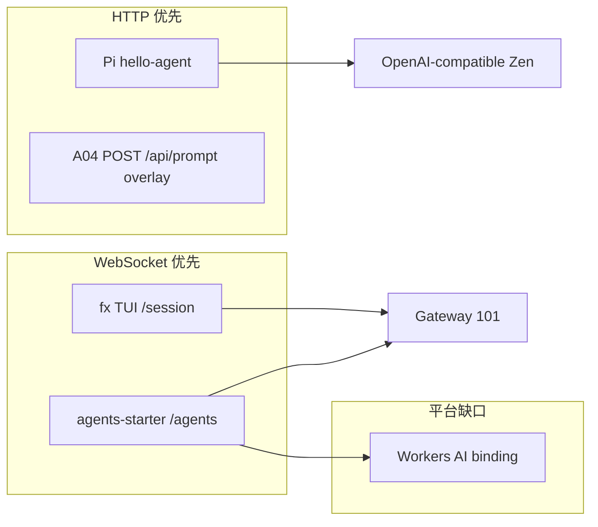

# cellp / celld WebSocket 支持 — 专题分析

> **类型：** 专题分析（架构 + 现状 + 缺口 + 验收），非实现规格。  
> **日期：** 2026-09-03  
> **读者：** 控制面 / 运行时 / Support 验证 / 产品  
> **关联规格：** [WEBSOCKET-INGRESS-DESIGN.md](./WEBSOCKET-INGRESS-DESIGN.md) v0.2 · [INGRESS-ROUTING.md](./INGRESS-ROUTING.md) §4.4  
> **缺陷：** [platform-defects-log.md](../platform-defects-log.md) **PD-20260903-07**（`fixed` @ WS-M2）  
> **证据：** [websocket-ingress-h1h2.md](../evidence/websocket-ingress-h1h2.md) · [ws-ingress-verify-2026-09-03.log](../evidence/ws-ingress-verify-2026-09-03.log)

---

## 1. 为什么要单独谈 WebSocket

cellp 的定位是 **分布式 Workers 控制面 + Gateway 反代**（[decisions.md](../decisions.md) AD-10、AD-12）。大量「Coding Agent on cellp」形态**不是**纯 HTTP 请求/响应：

| 产品形态 | 典型协议 | 依赖 WS 的原因 |
|----------|----------|----------------|
| **fx-on-workers**（A04） | 浏览器 xterm + `GET /session` Upgrade | TUI 字节流双向；wasm 会话在 **FxSession** DO |
| **agents-starter**（A01） | `/agents/*` WebSocket | Cloudflare Agents `ChatAgent` 实时通道 |
| **通用 DO 协作** | `WebSocketPair` + `acceptWebSocket` | 会话状态在 DO；HTTP 只能单轮 |
| **Pi hello-agent**（A02） | **HTTP JSON** | **不依赖** ingress WS（Zen + R2 工具） |

因此：**WebSocket 不是「可选炫技」**，而是 DO / 终端类 agent 的**主路径**；HTTP overlay（如 A04 `POST /api/prompt`）是 **mitigation**，不能替代全栈 WS 体验。

---

## 2. 端到端架构（四层）

```
浏览器 / curl
    │  RFC6455 Upgrade (Host: *.lvh.me)
    ▼
┌─────────────────────────────────────┐
│  cellp Gateway (:8787)              │  AD-12 Host → ingress_bindings → route
│  httputil.ReverseProxy + Hijacker   │  WS-M1：必须能 101，不能吞 Upgrade
└─────────────────────────────────────┘
    │  HTTP/1.1 到 upstream_host:port（每 version 一个 celld 监听端口）
    ▼
┌─────────────────────────────────────┐
│  celld（每 ready version 一进程）    │  AD-1：一 version 一 celld + bucket
│  ingress: main/websocket.rs         │  路由 WS 到 cell / DO
└─────────────────────────────────────┘
    │  isolate / V8
    ▼
┌─────────────────────────────────────┐
│  Worker / Durable Object            │  fetch() → stub → WebSocketPair
│  fx FxSession · agents ChatAgent …  │
└─────────────────────────────────────┘
```

**关键决策约束：**

- **AD-12：** 业务 path 从 `/` 起，Gateway **不** strip `/{project}/{version}`；选 version 靠 **Host**（或 Tier B 端口）。
- **AD-1：** 本地 dev 每 version 独立 celld 端口（如 `8823`）；registry `routes.upstream_port` 指向该端口。
- **AD-10：** cellp **不**终止公网 TLS；`wss` 由外层 LB（P1 / WS-M3）。

---

## 3. Cloudflare 语义 vs celld 现状（compat）

官方能力见 [celld/docs/cloudflare-compat.md](../../celld/docs/cloudflare-compat.md) **WebSockets：Partial**。

| 能力 | workerd / CF | celld（摘要） | 对 cellp 的影响 |
|------|----------------|---------------|-----------------|
| 入站 Upgrade → 101 | 支持 | ingress 有 `websocket.rs` 泵帧 | 直连 upstream 可 101 |
| `WebSocketPair` / DO | 支持 | 支持（fx、wsecho） | WS-M2 验收对象 |
| `acceptWebSocket()` hibernation | 支持 | 部分；`getTags` 等缺失 | P1，不关 PD |
| 出站 Worker WS | 支持 | 生命周期与 isolate 绑定 | Agent 调外部 API 另论 |
| heap 90% 拒绝新 WS | 有 | 有 | 压测 / M3 |
| DO 迁节点后 WS | 重连语义 | **连接断开，需应用重连**（[limitations.md](../../celld/docs/limitations.md)） | 多节点 OUT OF SCOPE M1–M2 |

**结论：** cellp 要交付的是 **「Gateway + 单节点 dev 栈上，DO 会话 WS 可握手、可泵帧」**；不是一次声明「与 CF 100% 一致」。

---

## 4. 故障分层：H1 vs H2

Support 验证（fx A04）曾稳定出现：

- `GET /?key=` → **200**（Worker 静态页正常）
- `GET /session` + `Upgrade: websocket` → **502**，body **`bad gateway`**

| 假设 | 含义 | 如何证伪 |
|------|------|----------|
| **H1** | Gateway `ReverseProxy` 在无 **Hijacker** 的中间件上处理 Upgrade → 无法 101 → 统一 `ErrorHandler` → 502 | **wsecho** 经 `:8787` 达 **101**（与业务无关的控制组） |
| **H2** | celld / Worker / DO 实现问题（426、500、非 101） | 直连 `127.0.0.1:<upstream_port>` 行为与经 Gateway 不一致 |

**四格矩阵**（设计 §6.1，证据表已填 2026-09-03）：

1. 直连 wsecho → 101  
2. Gateway wsecho → 101  
3. 直连 fx `/session` → 101  
4. Gateway fx `/session` → 101  

四格皆 101 时：**H1 已修复**，**A04 ingress WS 路径可用**；若仅 fx 失败而 wsecho 绿，则查 **H2-fx**（头、Cookie、子协议、AI Gateway 等应用层）。

---

## 5. 已交付里程碑（WS-M1 / WS-M2）

### WS-M1 — Gateway 代理层

**范围：** 仅 `cellp/internal/gateway`（+ 单测 + e2e 脚本 + 文档）。

**核心改动（概念）：**

- `isUpgradeRequest()` 识别 RFC6455 Upgrade。
- `statusRecorder` **委托** `Hijack` / `Flush` / `Unwrap`，避免 metrics 中间件吞 Hijack。
- `ReverseProxy.FlushInterval = -1`，减少 101 后缓冲问题。
- Upgrade 失败时 **结构化日志**（`classifyProxyError`: dial / hijack / other）。

**门禁：** `go test ./internal/gateway/...`；`e2e/scripts/v1-websocket-ingress.sh`（wsecho fixture，**默认不进** `run-all.sh`）。

**明确不做：** 不把 PD-07 标 `fixed`；不宣称「DO WS 生产完备」。

### WS-M2 — 产品路径（fx）

**关闭条件：** `support-fx-on-workers` 经 Gateway 的 `GET /session?key=...` Upgrade → **101**。

**2026-09-03 verification subagent：** 四格 101；**PD-20260903-07 → `fixed`**。

**仍属 PARTIAL 的原因：** 完整 fx **推理**依赖 `AI_GATEWAY_API_KEY`；WS 只解决「终端能连上」。

---

## 6. 未关闭 / 后续专题（WS-M3、P1）

| 主题 | 说明 | 优先级 |
|------|------|--------|
| 长连接与 archive / draining | 101 后 `touchLastAccess`、version drain 时 Close 帧 / 503 语义 | M3 |
| `active_websocket_connections` 等指标 | 握手 101 可记，存活连接 gauge | M3 |
| Hibernatable WS + `getTags` | compat Partial 项 | P1 |
| 多节点 DO WS 迁移动 | AD-1 dev 单 celld；fleet 级重连 | P1+ |
| 外层 `wss` + `X-Forwarded-Proto` | AD-10 不终止 TLS | P1 |
| CORS 与 101 响应头 | M1 不因 Origin 拒 Upgrade；剥离 101 上 CORS 头可后置 | P1 |
| Header smuggling / 双栈 fuzz | 安全硬化 | P1 |
| Gateway `ReadTimeout` / `WriteTimeout` | 须避免误杀已 Hijack 连接 | M3 设计时注意 |

---

## 7. 产品策略：三种 agent 接入模式



| 模式 | 适用 | cellp 要求 |
|------|------|------------|
| **HTTP + JSON** | 无状态 agent、OpenAI 兼容 API | 只需 Gateway HTTP 反代 |
| **HTTP overlay** | WS 未通前的 **自动化门禁** | 应用侧实现；文档化于 `dev/examples/.../README.md` |
| **WebSocket + DO** | 终端、实时 Agents | **WS-M1/M2** + celld DO；A01 另需 **Workers AI**（celld gap） |

---

## 8. 测试与回归策略

| 层级 | 命令 / 资产 | 用途 |
|------|-------------|------|
| 单元 | `cd cellp && go test ./internal/gateway/...` | 锁 Hijack / 502 分类 / 假上游 101 |
| E2E 控制组 | `bash e2e/scripts/v1-websocket-ingress.sh` | Host → Gateway → **wsecho** 101 + echo 帧 |
| 产品回归 | curl Upgrade → `support-fx-on-workers.lvh.me` `/session` | WS-M2 / A04 |
| Support 矩阵 | `docs/support-framework-user-acceptance.md` §A04 | 用户行为级（非仅状态码） |
| 证据 | `docs/evidence/websocket-ingress-h1h2.md` | H1/H2 四格记录 |

**注意：** `curl` 在 **101 后** 长连接可能 `exit 28`（超时）——属预期，以 **首行 HTTP 状态 101** 为准。

---

## 9. 结论（一页纸）

1. **WebSocket 是 DO / 终端 agent 的一等 ingress 能力**，与 AD-12 Host 路由正交、不可省略。  
2. **历史主因 H1**：Gateway 未 Hijack → 502 `bad gateway`；**WS-M1 已修**。  
3. **fx A04 WS-M2 已验收 101**；PD-20260903-07 **fixed**；**cellp dev 栈 WebSocket ingress 标为支持**（`e2e/scripts/v1-websocket-ingress.sh`、`dev/scripts/fx-websocket-smoke.sh`）。完整 fx 仍要 AI Gateway key。  
4. **celld compat 仍为 Partial**；M3/P1 管 hibernation、多节点、TLS、指标与安全。  
5. **验收分工**：自动化与四格矩阵由 **verification subagent** + e2e 脚本承担；规格与分期见 DESIGN §0。

---

## 10. 实现差距有多大？离「生产」有多远？

### 12.1 先分清三种「生产」

| 目标 | 含义 | WS 相关距离（粗估） |
|------|------|---------------------|
| **P-dev** | 本地 / 单机 dev 栈跑通 Support agent（fx TUI 能连、wsecho 门禁） | **已到**（WS-M2：Gateway + DO **101**） |
| **P-private** | 客户内网自建：外层 LB 终止 TLS + 单/少节点 cellp + celld fleet | **中等**（约 **2–4 个工程里程碑**，见下） |
| **P-CF** | 与 Cloudflare Workers 全球边缘、规模与 API 全矩阵对齐 | **很远**（**不在 cellp 产品范围**，AD-10） |

下面说的「差距」默认对比 **P-private 可运维部署**，不是对比 CF 全球边缘。

### 12.2 分层差距表（相对 workerd / CF 生产行为）

| 层 | 已对齐（dev 已验） | 仍有差距（compat / 运维） | 对「能上线」的影响 |
|----|-------------------|---------------------------|-------------------|
| **cellp Gateway** | Host 路由；HTTP 反代；**Upgrade → 101**（Hijack）；fx/wsecho 四格 | `wss` 终止在 cellp **不做**（AD-10）；长连接与 **drain/archive** 时 Close/503 语义（M3）；`ReadTimeout`/`WriteTimeout` 与 Hijack 共存；**active WS 连接数**指标；Tier B 第二入口须与 `:8787` 同测 | **不挡**内网 HTTP/WS 试点；**挡**「优雅摘流 + 可观测」的生产 SRE 标准 |
| **celld ingress** | `handle_websocket` 泵帧；DO `WebSocketPair`；fx **FxSession** 101 | [compat WebSockets **Partial**](https://developers.cloudflare.com/workers/runtime-apis/websockets/)：`getTags()` 无；子请求 upgrade 须 `accept()`；出站 WS 生命周期与 `waitUntil` 边界；**90% heap 拒新 hibernatable WS**；升级响应头与 CF 差异（protocol/connection 剥离等） | **不挡**单会话、单 DO、中等并发 TUI；**挡**依赖 hibernation 标签、大量长连接、与 CF 文档逐条一致的 SDK |
| **DO / 拓扑** | AD-1：一 version 一 celld、一 bucket | [limitations](https://github.com/KonghaYao/cellp/blob/main/celld/docs/limitations.md)：DO **出站 WS** 绑 cell，**迁节点则断连**须应用重连；节点对 **resident cell / outbound WS** 有上限 | **不挡** dev / 单节点；**挡**多节点弹性伸缩下的「不断线」预期 |
| **应用生态** | fx、agents-starter、wsecho 可部署 | A01 要 **Workers AI**（celld 无 binding）；fx 要 **AI Gateway key** | **与 WS 无关**，但 agent「生产可用」仍缺模型面 |

**量化体感（非精确人月）：**

- **Ingress WS 通路**（Gateway + 101 + 泵帧）：相对 CF **~85–90%** 覆盖「能握手、能双向传帧」的主路径；缺的是边缘 TLS、全球 POP、与 CF 一致的 header/hibernation 边角。
- **Workers WS API 语义**：celld 自评 **Partial**；相对 CF 文档全矩阵约 **~70%**（常见 DO + `acceptWebSocket` 够用；`getTags`、部分出站语义、压测边界未承诺）。
- **cellp 控制面 + 运维**：WS 专项外还有 archive/wake、多 version、无账号体系等 —— **P-private** 要的是「整栈可运维」，WS 只是其中一块。

### 12.3 与 Cloudflare 生产差在哪（刻意不做 vs 真缺口）

**刻意不做（AD-10，不算 bug）：**

- 全球边缘 PoP、Anycast、CDN、WAF、DNS、在 cellp 上终止公网 TLS。
- 把浏览器 URL 指到 celld 随机上游口（产品入口必须是 Gateway Host）。

**真缺口（要排期才算「生产级 WS」）：**

1. **WS-M3（控制面 + Gateway）**：version draining 时 WS 行为；101 后 **last-access / archive** 不误杀长会话；连接级指标与告警。
2. **celld P1（运行时）**：hibernatable WS 与 **`getTags()`**；与 CF 一致的升级响应头策略（若 SDK 依赖）。
3. **多节点 fleet**：DO WS 在 cell 迁移时的 **重连契约**（文档化 + 应用侧）；peer_tunnel 经 Gateway 的稳定性（G6，M1–M2 未覆盖）。
4. **压测与 SLO**：长连接数、内存、FD、`CELLD_V8_HEAP_LIMIT_MB` 下的 **拒绝策略** 是否有生产数据（celld README 有采样，cellp 未绑门禁）。

### 12.4 一句话结论

- **实现差距**：**握手与代理层（H1）曾是大洞，已补上**；剩余主要是 **Partial API + 长连接运维 + 多节点语义**，不是「完全没 WS」。
- **离生产**：  
  - **Support / 本地 agent 演示**：**已够**（101 + 应用 key）。  
  - **客户内网生产（P-private）**：还差 **WS-M3 + 部分 celld compat + 压测证据**，量级是 **可控的几个里程碑**，不是重写运行时。  
  - **对标 Cloudflare 边缘 Workers**：**不在路线图上**；差距是产品范畴，不是再修一个 Hijack 能解决的。

---

## 11. 文档索引

| 文档 | 内容 |
|------|------|
| [WEBSOCKET-INGRESS-DESIGN.md](./WEBSOCKET-INGRESS-DESIGN.md) | 工程计划、M1/M2/M3、§4 Gateway 方案 A/B |
| [WEBSOCKET-INGRESS-DESIGN.md](./WEBSOCKET-INGRESS-DESIGN.md) | 工程规格与辩论决议（§0） |
| [WEBSOCKET-INGRESS-TEST-PLAN.md](./WEBSOCKET-INGRESS-TEST-PLAN.md) | 测试计划（若已生成） |
| [dev/examples/support-fx-on-workers/README.md](../../dev/examples/support-fx-on-workers/README.md) | HTTP overlay + WS 限制说明 |
| [AGENT-SUPPORT.md](../AGENT-SUPPORT.md) | A01–A04 与 WS/HTTP 验收条 |
| [celld/docs/cloudflare-compat.md](../../celld/docs/cloudflare-compat.md) | WebSockets Partial 明细 |
