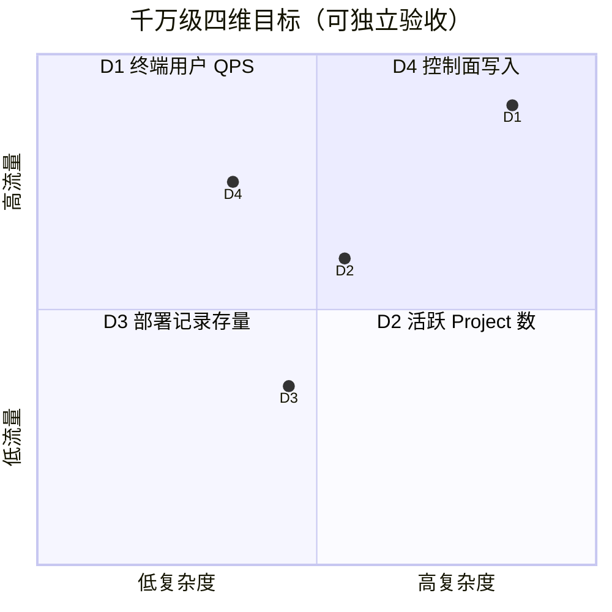
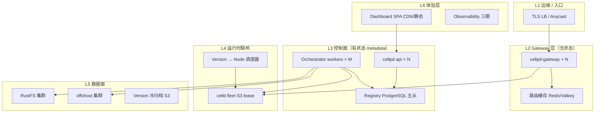
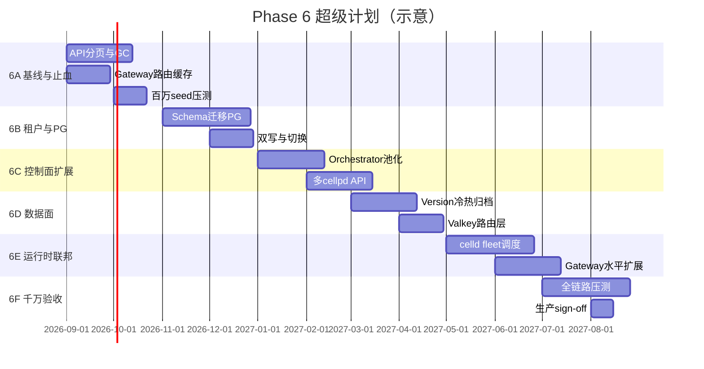
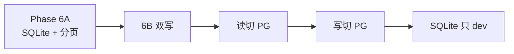

# Phase 6 — 千万级全量扩展超级计划（Master Plan）

> **代号：** SCALE-10M  
> **状态：** 6A COMPLETE (SQLite scope) · 2026-08-29  
> **范围约束（2026-08-29）：** **不做 PostgreSQL、不做多租户/RBAC**。Phase 6 仅执行 **6A**（SQLite 分页 + Gateway 缓存 + GC + Dashboard + 压测基线）。6B–6F 标记为 **OUT OF SCOPE**。
> **前置：** Phase 0–5 完成（M3 压测 sign-off）  
> **上位文档：** [DESIGN.md](../../DESIGN.md) · [test-plan-phase2.md](../test-plan-phase2.md)  
> **本文定位：** 从「单节点私有化 PaaS」演进到「千万级用户可承载平台」的**全量级**路线图 — 含目标定义、数据模型、架构、压测、迁移、门禁。

---

## 0. 执行摘要

| 项 | 内容 |
|----|------|
| **North Star** | 在 **100% 私有化** 约束下，支撑 **1000 万终端用户并发访问** + **100 万活跃 Project** + **1 亿条 Version 历史（可归档）** |
| **当前一期上限** | 单 cellpd · SQLite · Gateway ~500 RPS · ≤5–20 ready versions/project · 无用户/租户 |
| **结论** | 千万级 **不是调参问题**，是 **控制面换存储 + 运行时联邦 + 租户模型 + 路由/cache 层** 的系统工程 |
| **预估阶段** | 6 个子阶段（6A–6F），约 **4–6 个工程季度**（视团队规模） |
| **首期必做（6A）** | API 分页 · Gateway 路由缓存 · Job/Version GC · 百万行 seed 压测 · 容量基线报告 |

---

## 1. 「千万级」定义 — 四维目标矩阵

cellp 一期 **无 User 表**（DESIGN §1）。扩展必须先锁定「千万」指哪一维：



| ID | 维度 | 定义 | 10M 目标 | 当前设计支撑 | 差距等级 |
|----|------|------|----------|--------------|----------|
| **D1** | **终端用户** | 通过 Gateway 访问已部署 App 的 end-user | 峰值 **100k–500k RPS**（假设 1000 万 DAU、5% 同时在线） | ~500 RPS（TP2-L4） | 🔴 100–1000× |
| **D2** | **活跃 Project** | Registry 中可列表/操作的 project 数 | **100 万** 活跃 + 900 万归档 | 全量 `ListProjects` 无分页 | 🔴 |
| **D3** | **Version 历史** | 累计 deployment 行数 | **1 亿**（热 1000 万 + 冷 9000 万） | 全量 `ListVersions` 无分页 | 🔴 |
| **D4** | **控制面 QPS** | `POST /versions`、promote、destroy | **1k–5k deploy/min** 跨租户 | 单 Orchestrator + SQLite 单写 | 🔴 |

**超级计划验收原则：** 四个维度 **分别设 Gate**；不允许「Gateway 撑住了但 Registry OOM」的伪通过。

---

## 2. 现状基线（As-Is）

### 2.1 架构

```
[CI] → POST /versions → [cellpd API] → [SQLite Registry] ←→ [Orchestrator 单 loop]
                              ↓
                         [Gateway 查库/route] → [celld per version :port]
```

### 2.2 Registry Schema（SQLite）

| 表 | 用途 | 索引 | 千万级问题 |
|----|------|------|------------|
| `projects` | 项目元数据 | PK `id` | `ListProjects` 全表扫描 |
| `versions` | 部署记录 + 状态机 | `(project_id, id)`, `(project_id, status)` | 单项目全量加载；无归档 |
| `routes` | Gateway upstream | PK `(project_id, version_id)` | 热路径逐请求查库 |
| `jobs` | 部署队列 | `idx_jobs_status` | 无 TTL 清理；单 worker claim |

**硬约束：** `SetMaxOpenConns(1)` · WAL · busy retry 50ms→2s×30

### 2.3 运行时

| 组件 | 模型 | 上限 |
|------|------|------|
| celld | **每 version 一进程/端口**（8792+N） | ~1000 进程/宿主机 |
| Gateway | Go reverse proxy，**同步 Registry 读** | 单进程 ~500 RPS（已测） |
| Artifact | RustFS S3，prefix 扁平 fetch（已修 path） | 对象数 / list 延迟 |
| Dashboard | Vite SPA 静态部署，API 直连 :8790 | 依赖 API 分页 |

### 2.4 已测阈值（stress-env.json）

| 指标 | 值 |
|------|-----|
| Gateway RPS | 500 |
| Gateway p99 | 500ms |
| 并发 CD | 3 路 / 900s |
| Ready versions cap | 5（压测）/ 20（dev env） |
| Registry 24h 增长 | <500MB |

---

## 3. 目标架构（To-Be）— 六层模型



### 3.1 设计原则（扩展期）

1. **控制面与数据面分离** — Gateway 热路径 **禁止** 同步查 PG/SQLite  
2. **Cell 化** — 按 `tenant_id` 或 `project_id hash` 分 cell（独立 cellpd 单元）  
3. **热冷分离** — Version 30 天热表 + S3/Parquet 冷归档  
4. **私有化不变** — RustFS · 自建 PG · Valkey · 无公有云绑定  
5. **可降级** — 单 cell 故障不影响全局（bulkhead）

---

## 4. 数据模型演进（全量）

### 4.1 新增实体（租户层）

一期缺失 **User/Org**，千万级必须引入：

```sql
-- 6B 阶段引入（PostgreSQL）

CREATE TABLE orgs (
  id          TEXT PRIMARY KEY,
  name        TEXT NOT NULL,
  plan        TEXT NOT NULL DEFAULT 'free',  -- free | pro | enterprise
  created_at  TIMESTAMPTZ NOT NULL
);

CREATE TABLE org_members (
  org_id      TEXT NOT NULL REFERENCES orgs(id),
  user_id     TEXT NOT NULL,
  role        TEXT NOT NULL,  -- owner | admin | developer | viewer
  PRIMARY KEY (org_id, user_id)
);

CREATE TABLE projects (
  id          TEXT PRIMARY KEY,
  org_id      TEXT NOT NULL REFERENCES orgs(id),
  git_remote  TEXT,
  prod_version_id TEXT,
  created_at  TIMESTAMPTZ NOT NULL,
  archived_at TIMESTAMPTZ
);
CREATE INDEX idx_projects_org ON projects(org_id) WHERE archived_at IS NULL;
```

### 4.2 Version 热冷分离

```sql
-- 热表：近 30 天 / 最近 1000 条 / ready+draining
CREATE TABLE versions_hot (
  -- 同现有 versions 列
  project_id  TEXT NOT NULL,
  id          TEXT NOT NULL,
  status      TEXT NOT NULL,
  ...
  PRIMARY KEY (project_id, id)
);
CREATE INDEX idx_versions_hot_proj_created
  ON versions_hot(project_id, created_at DESC);

-- 冷表：按月分区或外表（S3 + manifest）
CREATE TABLE versions_cold_manifest (
  project_id  TEXT,
  month       DATE,
  s3_uri      TEXT,
  row_count   BIGINT,
  PRIMARY KEY (project_id, month)
);
```

### 4.3 路由表 → 缓存优先

| 层 | 结构 | 读路径 |
|----|------|--------|
| **L1** | Gateway 进程内 LRU（prod + 热点 preview） | <1ms |
| **L2** | Valkey `route:{project}:{version}` → host:port | <5ms |
| **L3** | PG `routes` 权威 | 写时更新 L1/L2 |

Gateway 读：**L1 → L2 → L3**，写：**PG 事务提交 → pub/sub invalidate**

### 4.4 Job 队列演进

| 阶段 | 实现 | 吞吐 |
|------|------|------|
| 现况 | SQLite `jobs` + 单 claim | ~10/min 可靠 |
| 6C | PG `FOR UPDATE SKIP LOCKED` + N workers | ~500/min |
| 6D | 可选 NATS/Redis Stream（私有化部署） | ~5k/min |

---

## 5. 容量规划（数学模型）

### 5.1 存储估算（D2 + D3 满配）

| 实体 | 行数 | 行大小（估） | 总容量 |
|------|------|-------------|--------|
| orgs | 10 万 | 200B | 20MB |
| projects（活跃） | 100 万 | 300B | 300MB |
| versions_hot | 1000 万 | 500B | **5GB** |
| versions_cold | 9000 万 | 50B（manifest 指针） | 4.5GB 索引 + S3 |
| routes（active） | 500 万 | 100B | 500MB |
| jobs（7 天滚动） | 100 万 | 200B | 200MB |

**PG 主库：** 建议 **50GB SSD 起步**，热表分区 + 自动 VACUUM。

### 5.2 Gateway（D1）

假设 counter 类 Worker，p99 50ms：

| RPS | 所需 Gateway 实例（4C8G，80% CPU） | 备注 |
|-----|-----------------------------------|------|
| 500 | 1（已测） | 基线 |
| 50k | ~80–100 | 需路由缓存命中 >99% |
| 500k | ~800 + Anycast 多 POP | 需 celld 联邦 |

**关键：** 500k RPS 时 **Registry 读必须为 0**（全缓存）。

### 5.3 celld 联邦（D1 + 部署密度）

| 模式 | 每节点 versions | 100 万 active preview | 方案 |
|------|-----------------|----------------------|------|
| 现况 1 proc/version | ~500 max | ❌ | — |
| 6E：多 version 共享 celld | ~50/version 逻辑隔离 | 需 celld 多租户 | 待 celld 能力确认 |
| 6E：K8s pod per project | 1 pod N versions | 20k nodes | 运维重 |

**诚实边界：** 100 万 **同时 active preview** 不现实；产品应推 **prod + 少量 preview + scale-to-zero**。

### 5.4 控制面（D4）

`POST /versions` 全链路 ~2–30s（deploy 重）。  
**1k deploy/min** = ~17 QPS 入队 — Orchestrator **可队列化**；瓶颈在 **RustFS + celld deploy**，非 API 本身。

---

## 6. 子阶段路线图（6A – 6F）



### 6A — 基线与止血（不改 Registry 引擎）

**目标：** 在 SQLite 上探明 **硬上限**，为 PG 迁移提供数据。

| Track | 交付 | Gate |
|-------|------|------|
| **6A-T1** | `GET /projects?limit&cursor` · `GET /versions?limit&cursor&status` | TP6-A1 |
| **6A-T2** | Gateway `RouteCache`（Ristretto/arc，写 invalidate） | TP6-A2 p99 -50% @500 RPS |
| **6A-T3** | `jobs`/`versions` GC cron | TP6-A3 jobs <100k 行 |
| **6A-T4** | Dashboard 虚拟列表 + cursor API | TP6-A4 1万行流畅 |
| **6A-T5** | `stress/scripts/seed-*.sh` + `registry-bench.sh` | TP6-A5 报告 |

**TP6-A5 门禁：**

| 规模 | 通过标准 |
|------|----------|
| 10k projects | `ListProjects` cursor p99 <200ms |
| 100k versions/项目（模拟 10 项目 ×1 万） | 分页 p99 <100ms |
| 100k Gateway RPS（cached route） | 错误率 <0.1% |

### 6B — 租户模型 + PostgreSQL

**目标：** 支撑 **100 万 Project** metadata。

| Track | 交付 |
|-------|------|
| **6B-T1** | PG schema（orgs · members · projects · versions_hot · routes · jobs） |
| **6B-T2** | `registry.Store` interface 双实现：SQLite（dev）+ PG（prod） |
| **6B-T3** | 迁移工具：`sqlite-to-pg` 一次性 + 增量 replay |
| **6B-T4** | Auth：OIDC / API key per org（替代单 token） |
| **6B-T5** | RBAC middleware + OpenAPI 更新 |

**Gate TP6-B1：** 100 万 project seed；`ListProjects` cursor p99 <100ms @PG 主库。

### 6C — 控制面水平扩展

| Track | 交付 |
|-------|------|
| **6C-T1** | Orchestrator worker pool（`SKIP LOCKED` claim） |
| **6C-T2** | cellpd API 无状态化 ×N + sticky 无关 |
| **6C-T3** | Deploy 队列深度监控 + 429/503 背压 |
| **6C-T4** | **Cell 分片**：`hash(org_id) % N` → cell 路由 |

**Gate TP6-C1：** 3 cell × 1000 并发 POST → 95% 入队 <5s。

### 6D — 数据面与归档

| Track | 交付 |
|-------|------|
| **6D-T1** | Version 冷归档 worker（S3 parquet/jsonl） |
| **6D-T2** | `GET /versions?include=cold` 按需拉冷 |
| **6D-T3** | Valkey 路由权威缓存 + pub/sub |
| **6D-T4** | RustFS 多节点 + list 性能调优 |

**Gate TP6-D1：** 1 亿 version manifest；热表 stable <10GB。

### 6E — 运行时联邦（D1 核心）

| Track | 交付 |
|-------|------|
| **6E-T1** | celld fleet 调度器（S3 lease 已有 → 扩展） |
| **6E-T2** | Gateway 层无状态扩展 + LB |
| **6E-T3** | Preview scale-to-zero + 唤醒（DESIGN 二期） |
| **6E-T4** | 区域 Cell（多集群，可选）

**Gate TP6-E1：** 50k RPS 单项目 prod；p99 <100ms；5xx <0.01%。

### 6F — 千万验收（Full Sign-off）

| 场景 | 负载 | 通过 |
|------|------|------|
| **F1 终端洪峰** | 500k RPS 混合读写 | 5xx <0.01%，p99 <200ms |
| **F2 租户规模** | 100 万 project 随机查询 | p99 <100ms |
| **F3 部署风暴** | 5k deploy/min ×10min | 队列无丢；95% ready <10min |
| **F4 混沌** | 随机 kill cellpd/celld/RustFS 节点 | 自愈 <5min |
| **F5 24h Soak** | F1 的 10% 负载 | 内存无泄漏；PG 连接稳定 |

---

## 7. API 全量变更清单

### 7.1 必须新增

| Method | Path | 用途 |
|--------|------|------|
| GET | `/v1/orgs` | 租户列表 |
| POST | `/v1/orgs` | 创建租户 |
| GET | `/v1/orgs/{oid}/projects?cursor&limit` | 分页项目 |
| GET | `/v1/projects/{id}/versions?cursor&limit&status&since` | 分页部署 |
| GET | `/v1/projects/{id}/versions/{vid}/events` | 部署事件流（可选 SSE） |
| POST | `/v1/projects/{id}/versions/{vid}/retry` | 失败重试 |
| GET | `/v1/health/deep` | 依赖探针（PG/Valkey/RustFS） |

### 7.2 必须修改

| 现 API | 问题 | 改法 |
|--------|------|------|
| `GET /v1/projects` | 全量 | 默认 `limit=50`；最大 200 |
| `GET /v1/projects/{id}` | 嵌入全 versions | 仅 summary + `versions_url` |
| `POST .../promote` | 返回片段 | 统一 `ProjectDetail` 或 ETag |
| Auth | 单 token | Org-scoped API key + JWT |

### 7.3 内部 API（Gateway ↔ 控制面）

| 事件 | 机制 |
|------|------|
| Route 变更 | PG trigger → NOTIFY → Valkey SET + Gateway LRU purge |
| Prod 指针变更 | 同上 + 原子 swap key `prod:{project}` |

---

## 8. Dashboard / SPA（L6）

| 阶段 | 能力 |
|------|------|
| 现况 | Vite SPA · 静态 cellp 部署 · 全量拉取 |
| 6A | 游标分页 · 虚拟滚动 · skeleton |
| 6B | 登录 · Org 切换 · RBAC 隐藏操作 |
| 6C | 部署实时状态（SSE/WebSocket） |
| 6D | 冷归档版本搜索（慢查询 UX） |
| 6E | 多区域 project 指示 |

**构建注意：** `VITE_CELLP_*` 生产注入；**禁止**把 admin token 打进公开 artifact（6B 改 OIDC）。

---

## 9. 可观测性（贯穿 6C–6F）

| 信号 | 工具 | SLO |
|------|------|-----|
| Gateway RPS/latency | Prometheus | p99 <200ms @50k RPS |
| Deploy 队列深度 | PG gauge | <10k pending |
| Registry 查询 | PG slow log | >100ms 告警 |
| celld fleet | celld lease metrics | 无 split-brain |
| 业务 | per-org deploy rate | 配额告警 |

**三期 OTEL** 在 6C 起 **硬前置**（非可选）。

---

## 10. 迁移策略（SQLite → PG）



| 步骤 | 动作 | 回滚 |
|------|------|------|
| 1 | PG 从库只读同步 | 停从库 |
| 2 | API 双写（SQLite+PG） | 关 PG 写 |
| 3 | 读流量 10%→100% PG | 切回 SQLite 读 |
| 4 | 停 SQLite 写 | 恢复双写 |
| 5 | dev 保留 SQLite mock | — |

**数据校验：** row count + hash sample + promote 指针一致性。

---

## 11. 压测与证据体系

### 11.1 新增脚本（stress/phase6/）

| 脚本 | 维度 | 目标 |
|------|------|------|
| `seed-orgs.sh` | D2 | 10k org × 100 project |
| `seed-versions.sh` | D3 | 每 project 10k version |
| `list-api-load.sh` | D2/D3 | vegeta GET cursor |
| `gateway-scale.sh` | D1 | 50k→500k RPS 阶梯 |
| `deploy-storm.sh` | D4 | 5k/min POST |
| `registry-size-report.sh` | — | PG/SQLite 大小 + 慢查询 |

### 11.2 证据文件

| 路径 | 内容 |
|------|------|
| `docs/evidence/scale-env.json` | 集群拓扑、节点规格 |
| `docs/evidence/scale-metrics.jsonl` | 每阶段 append |
| `docs/evidence/scale-report-{6A..6F}.md` | 人读报告 |

---

## 12. 风险登记册

| ID | 风险 | 影响 | 缓解 |
|----|------|------|------|
| R1 | celld 不支持高密度 multi-tenant | D1 上限 | 与 celld 社区/上游 roadmap 对齐；preview scale-to-zero |
| R2 | RustFS 千万对象 list 慢 | deploy 超时 | bucket 分片；prefix 哈希 |
| R3 | PG 迁移双写不一致 | prod 指针错误 | CAS + 对账 job |
| R4 | 单 cellpd 脑裂 | 路由错乱 | cell 边界 + lease |
| R5 | Dashboard token 泄露 | 安全 | 6B OIDC |
| R6 | 范围蔓延 | 延期 | 6A–6F 硬 Gate，未过不并进 |

---

## 13. 组织与并行 Workstream

| Workstream | Owner 角色 | 6A | 6B | 6C | 6D | 6E | 6F |
|------------|-----------|----|----|----|----|----|-----|
| **Registry/DB** | Backend | 分页 | PG | pool | 归档 | — | 验 |
| **Gateway** | Backend | cache | — | LB | Valkey | 50k+ | 500k |
| **Orchestrator** | Backend | GC | 迁移 | pool | — | 调度 | 风暴 |
| **Runtime** | Systems | — | — | — | — | fleet | 混沌 |
| **Dashboard** | Frontend | 分页UI | Auth | SSE | 搜索 | — | E2E |
| **SRE/Stress** | QA | seed | 迁移测 | 并发 | 归档测 | 压测 | sign-off |

**Subagent 派发：** 每 Track 独立 branch；Gate 未过禁止下一 Phase merge。

---

## 14. 与现有 Phase 0–5 的关系

| 现有 | 6 阶段处理 |
|------|-----------|
| DESIGN「一期 SQLite 权威」 | **dev 保留**；prod 6B 切 PG，更新 DESIGN §2.2 |
| DESIGN「≤5 ready versions」 | 6D 改为 **tier 配额**（free 5 / pro 100 / enterprise 可配） |
| DESIGN「Dashboard」 | ✅ **Vite SPA**（`web/`）— DESIGN 已更新 |
| test-plan-phase2 单节点 | 6F 新增 **test-plan-phase6.md** |
| 禁止 PostgreSQL（docs/README） | **6B 起解除 prod 禁止**；dev 仍 SQLite |

---

## 15. 立即行动项（6A 第一周）

- [x] 新建 `docs/test-plan-phase6.md`（从本文 Gate 表导出 TP6-*）
- [x] OpenAPI：cursor 分页 RFC（`Link` header 或 `next_cursor`）
- [x] `cellp/internal/gateway/route_cache.go` 设计稿
- [x] `stress/phase6/seed-projects.sh` 原型（1k → 10k → 100k 阶梯）
- [x] 更新 [DESIGN.md](../../DESIGN.md) §14 Phase 6 基线 → 指向本文
- [x] Dashboard：`ProjectsPage` 改 cursor fetch

**6A 验收（2026-08-29，SQLite 单租户）：**

| Gate | 结果 | 证据 |
|------|------|------|
| TP6-A1 分页 API | ✅ | `go test ./internal/registry` |
| TP6-A2 Gateway cache | ✅ | `go test ./internal/gateway` |
| TP6-A3 GC | ✅ | `go test ./internal/gc` |
| TP6-A4 Dashboard | ✅ | Playwright 7/7 |
| TP6-A5 @ 1k projects | ✅ | p99 64ms |
| TP6-A5 @ 10k projects | ⚠️ | p99 **262ms**（gate 200ms；SQLite 上限，见 scale-report-6A.md） |

**6B–6F：** OUT OF SCOPE（不做 PG / 多租户）。

---

## 16. 验收里程碑总表

| 里程碑 | 含义 | 维度 |
|--------|------|------|
| **M4** | 6A Gate 全绿 | 分页 + cache + 10k 规模 |
| **M5** | 6B PG 切换完成 | D2 100万 project |
| **M6** | 6E Gateway 50k RPS | D1 核心 |
| **M7** | 6F 千万 sign-off | D1–D4 全绿 |

---

## 附录 A — 当前 Schema → 目标 Schema 字段对照

| 现 `versions` | 6B `versions_hot` | 备注 |
|---------------|-------------------|------|
| `id` | `id` | — |
| `project_id` | `project_id` | + FK org 链 |
| `status` | `status` | 枚举不变 |
| `artifact_uri` | `artifact_uri` | — |
| `ttl` | `ttl` | GC 强制 |
| — | `archived_at` | 6D 新增 |

## 附录 B — 参考竞品容量级（私有化对标）

| 平台 | 控制面 | 运行时 | 启示 |
|------|--------|--------|------|
| Vercel | 分布式 metadata + Edge Config | Serverless 多区域 | 路由必须 edge-cache |
| 自建 PaaS | PG + Redis | 单/多 host | 控制面可水平扩展 |
| K8s+Knative | etcd | Pod 调度 | cellp 6E 方向 |

---

*Phase 6 Master Plan v1 · 2026-08-29 · 全量级扩展路线图*
